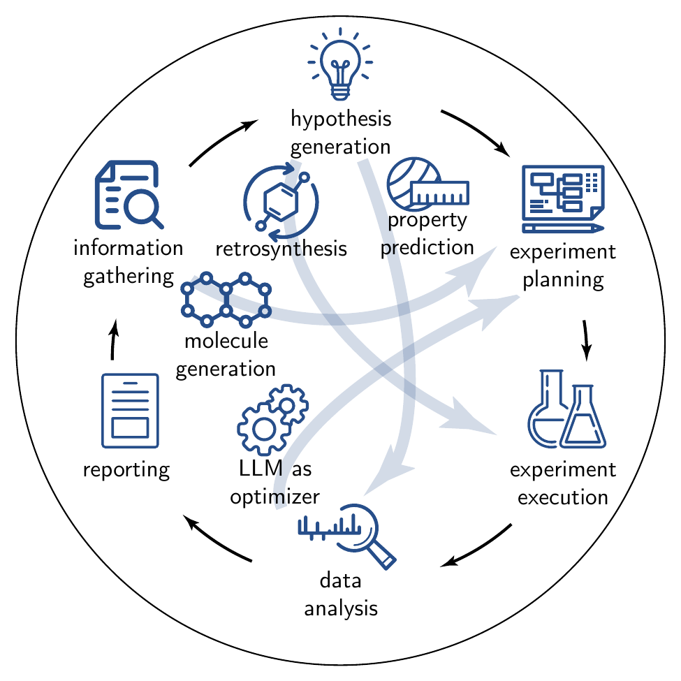
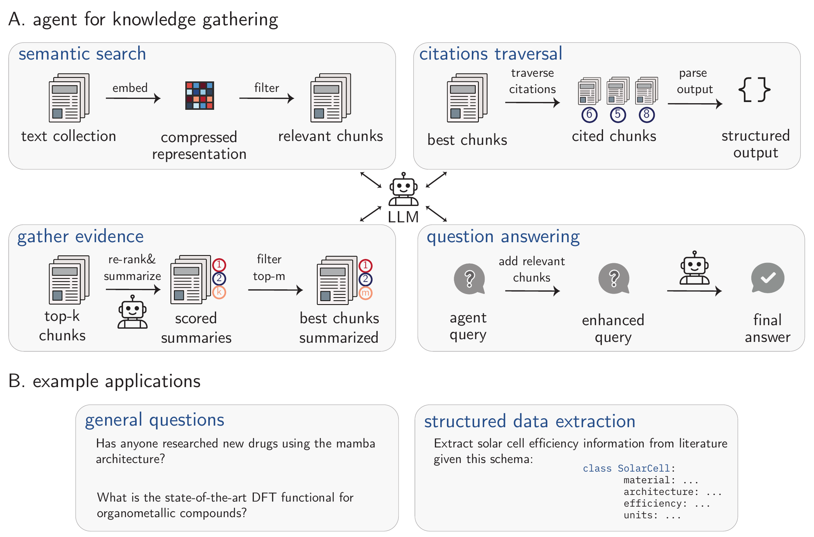
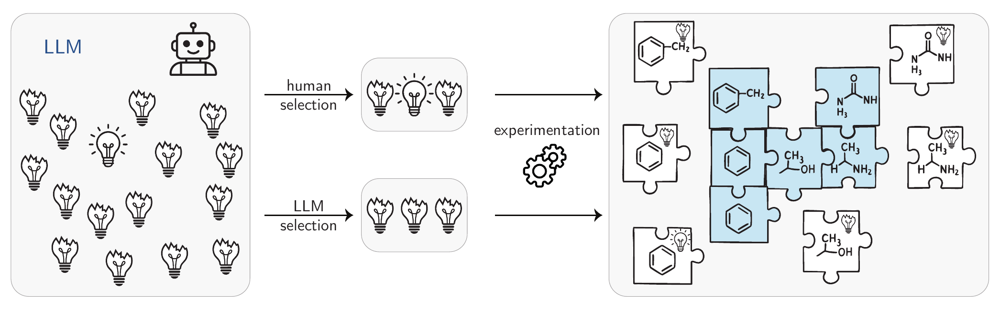
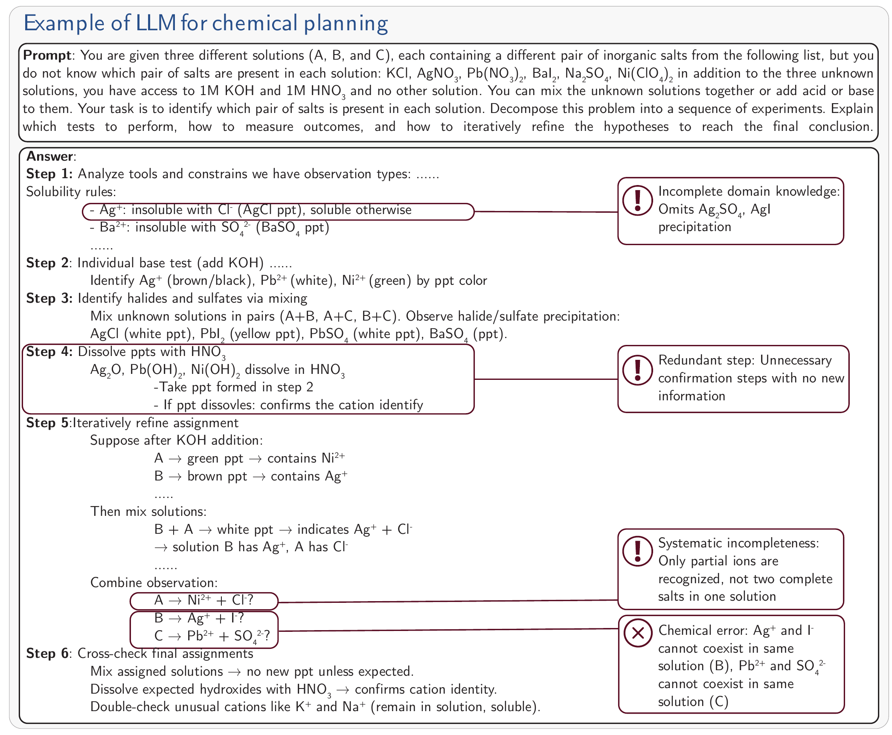
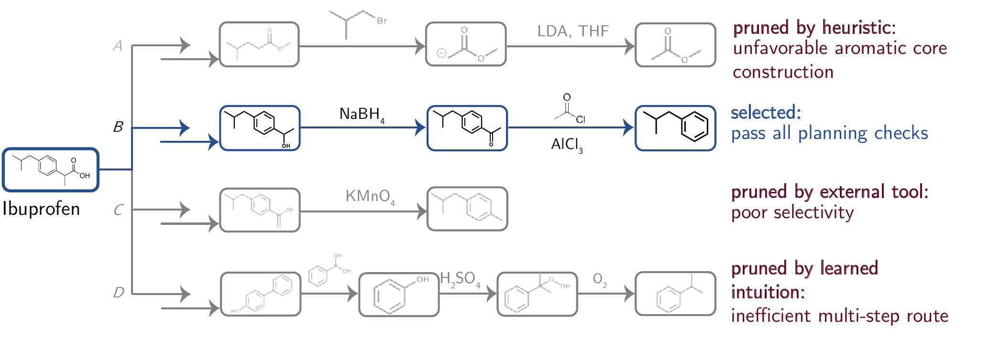
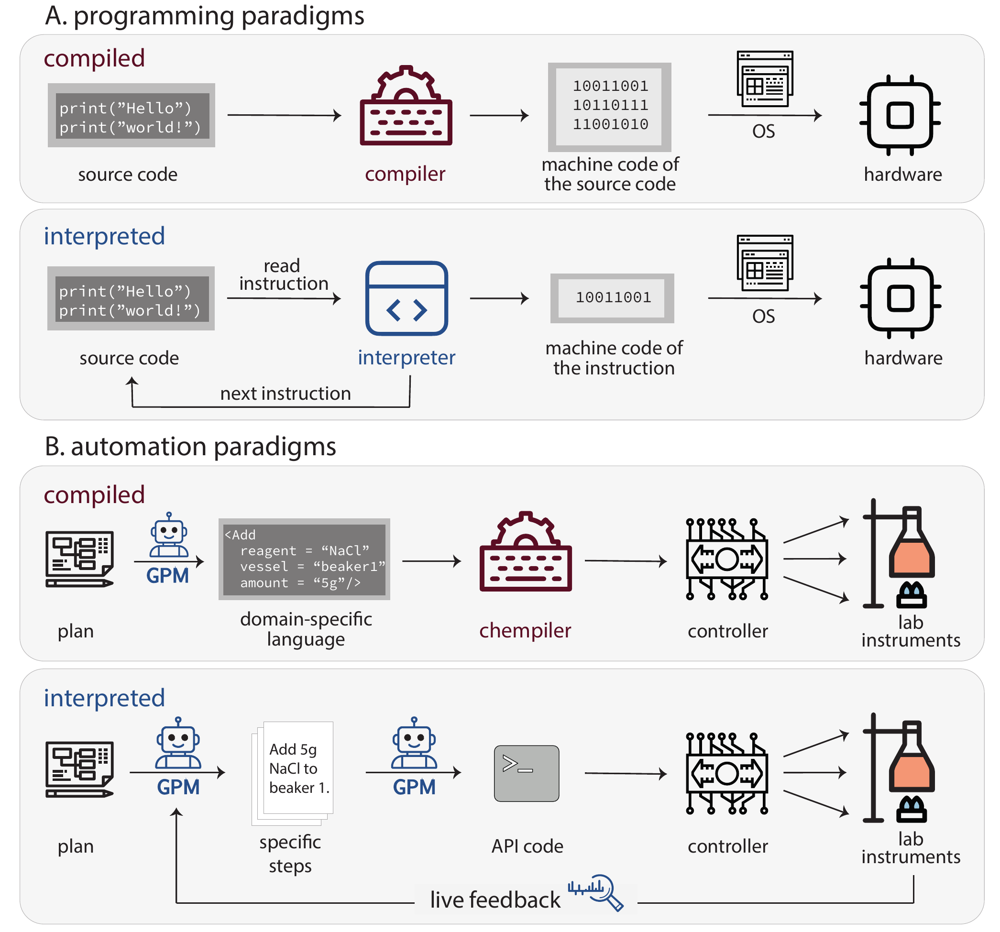
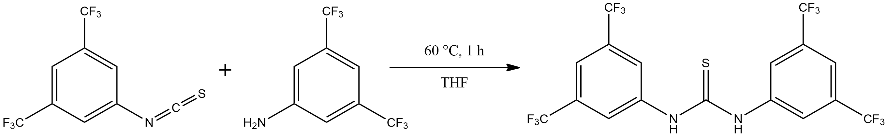
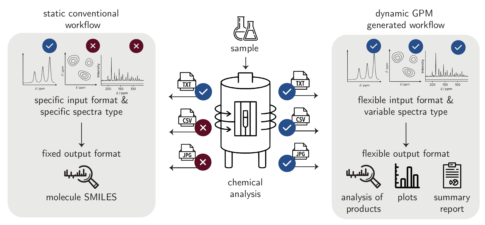

---
format:
  html:
    toc: true
    smooth-scroll: true
    anchor-sections: true
    other-links:
    - text: Visit our website
      href: https://lamalab.org/
      icon: globe
    - text: Follow us on X (Twitter)
      href: https://x.com/jablonkagroup
      icon: twitter-x
    - text: We are hiring!
      href: https://forms.fillout.com/t/eoGA7AhnAKus
      icon: person-badge
    - text: Contact us
      href: mailto:contact@lamalab.org
      icon: mailbox
acronyms:
  insert_loa: false 
  insert_links: false  
  fromfile: ./acronyms.yml
---

# Applications

## Automating the Scientific Workflow {#sec-ai-scientists}

Recent advances in \acr{gpm}s, particularly \acr{llm}s, have enabled initial demonstrations of
fully autonomous \acr{ai}
scientists \[@schmidgall2025agent\]. We define these as
\acr{llm}-powered
architectures capable of executing end-to-end research workflows based
solely on the final objectives, e.g., "*Unexplained rise of
antimicrobial resistance in Pseudomonas. Formulate hypotheses, design
confirmatory in vitro assays, and suggest repurposing candidates for
liver-fibrosis drugs*". Such systems navigate partially or entirely
through all components of the scientific process outlined in @fig-applications, and detailed in the subsequent sections.

While there are plenty of demonstrations of such systems in
\acr{ml} and programming,
scientific implementations remain less explored.

### Coding and ML Applications of AI Scientists

Frameworks such as `Co-Scientist` \[@gottweis2025towards\], and
`AI-Scientist`
\[@yamada2025ai\] aim to automate the entire \acr{ml} research pipeline. They typically use
multi-agent architectures (described in detail in @sec-multi-agent) where specialized agents manage distinct
phases of the scientific method \[@schmidgall2025agentrxiv\]. Critical
to these systems is self-reflection
\[@renze2024self0reflection\]---iterative evaluation and criticism of
results within validation loops. However, comparative analyses reveal
that \acr{llm}-based
evaluations frequently overscore outputs relative to human assessments
\[@huang2023mlagentbench0; @chan2024mle; @starace2025paperbench0\]. An
alternative is to couple these systems with evolutionary algorithms.
`AlphaEvolve` \[@novikov2025alphaevolve\] is an
\acr{llm} operating
within a \acr{ga}
environment and discovered novel algorithms for matrix multiplication
(which had remained unchanged for fifty years) and sorting.

### Chemistry and Related Fields

In chemistry, proposed systems showed some initial sparks. `Robin`
identified ripasudil as a treatment for \acr{damd} \[@ghareeb2025robin0\]---despite pending
clinical trials and the general debate for these systems about the
novelty of their findings\[@Listgarten2024perpetual\]. However,
automation of experiment execution poses a major constraint for the
chemistry-focused \acr{ai}-scientists due to hardware requirements,
making computational chemistry the most feasible subfield in which
agents have successfully run simple quantum simulations
\[@Zou2025ElAgente\]. Further, the \acr{llm}s powering these systems exhibit limited
chemical knowledge \[@mirza2024large\]. Despite this, `ether0`
\[@narayanan2025training\]---the first chemistry-specialized reasoning
\acr{llm} (see @sec-rl for
a deeper discussion on reasoning models)---demonstrated strong
capabilities in molecular design and accurate reaction prediction,
positioning it as a possible foundation for chemistry-focused
\acr{ai} scientists.

### Are these Systems Capable of Real Autonomous Research?

Although agents like `Zochi` \[@intologyai2025zochi\] achieved
peer-reviewed publication in top-tier venues (\acr{acl} 2025), their capacity for truly
autonomous end-to-end research remains debatable \[@son2025ai\]. Even
when generating hypotheses that appear novel and impactful, their
execution and reporting of these ideas, as demonstrated by
@si2025ideation1execution, yield results deemed less attractive than
those produced by humans. Additionally, while \acr{ai} autonomous systems can generate
hypotheses, conduct experiments, and produce publication-ready
manuscripts, their integration requires careful consideration (refer to @sec-ethics
for further discussion on moral concerns
surrounding these systems).

### Limitations

Despite impressive demos, current "\acr{ai} scientists" systems are still hindered by
fundamental limitations. Their literature synthesis is often shallow,
and they have weak novelty checks, with audits of tools showing that
they can misclassify familiar ideas as "new", and generally struggle to
ground claims in prior work \[@beel2025evaluating\]. Execution is
equally fraught; automated pipelines exhibit fragile performance, and
silent errors that self-review cannot catch \[@luo2025automate3\],
necessitating expert oversight and validation \[@gottweis2025towards\].
In chemistry, beyond idea generation, the hardest problems are
infrastructural: closing the loop in real labs still runs into
orchestration and integration headaches, heterogeneous instrument
\acr{api}s, messy data
plumbing-issues \[@Canty2025science; @fehlis2025accelerating\], and
safety and governance concerns \[@Leong2024steering\]. Finally,
evaluation is immature (refer to @sec-trad_benchmarks
for a deeper discussion on these
evaluation methods): benchmarks for autonomous agents remain narrow and
inconsistent, making it hard to trust self-reported improvements or
generalize beyond tightly curated demos \[@yehudai2025survey\].

### Open Challenges

- **Capability**: Developing reliable long-horizon planning with
  verifiable execution traces \[@starace2025paperbench0\], evaluated on
  standardized, domain-grounded benchmarks \[@yehudai2025survey\].

- **Evaluation Beyond \acr{llm}-as-Judge**: Persistent biases and
  instability call for human-grounded protocols, adversarial test sets,
  and cross-lab replication \[@thakur2024judging;
  @starace2025paperbench0\].

- **Infrastructure**: Evolving literature operations from generic
  \acr{rag} to auditable
  claim-evidence graphs, contradiction mining, and robust novelty
  checks.

- **Trust & Governance**: Ensuring trustworthy autonomy through
  calibrated uncertainty quantification and clear authorship policies
  aligned with scholarly norms \[@ACS_AI_Policy_2024\].

::: {#fig-applications}
{width="100%"}

**Overview of the scientific process**. The
outer elements represent the typical scientific research process: from
gathering information and generating hypotheses based on the
observations, to executing experiments and analyzing the results. The
terms that are in the center represent data-driven “shortcuts” that
“accelerate” the typical scientific method. All stages represented in
the figure are discussed in detail in the following
sections.
:::

*True acceleration of chemical research and the ultimate goal of fully
autonomous science require \acr{ai} systems that can operate across the
entire scientific workflow. The stages outlined in @fig-applications---from hypothesis generation to
experimental execution and final reporting---represent the core of this
process. While \acr{gpm}s,
especially \acr{llm}s, show
promise in individual components, for \acr{ai} to evolve from a showcase into a driver
of fully autonomous research, it must master the entire workflow,
seamlessly navigating between each of these stages.*

## Existing GPMs for Chemical Science

The development of \acr{gpm}s for chemical science represents a departure
from traditional single-task approaches. Rather than fine-tuning
pre-trained models for specific tasks such as property prediction or
molecular generation, these chemistry-aware models are intentionally
designed to be capable of performing different chemical tasks. This
multitask learning unifies related chemical tasks, boosting data
efficiency and enabling emergent capabilities through joint training
across domains. @tbl-existing_gpms shows an overview of the existing
\acr{gpm}s in the chemical
sciences.

::: {#tbl-existing_gpms}
  **Model**                              **Architecture**                                                                                                         **Training**                                                                                                                                                                                                      **Representative Tasks**                                                                                                 **Representative Systems**
  -------------------------------------- ------------------------------------------------------------------------------------------------------------------------ ----------------------------------------------------------------------------------------------------------------------------------------------------------------------------------------------------------------- ------------------------------------------------------------------------------------------------------------------------ -------------------------------
  `DARWIN 1.5` \[@xie2025darwin\]        decoder-only transformer (LLaMA) with 7B parameters                                                                      fine-tuning on \acr{qa}s; multi-task fine-tuning on language-interfaced classification and regression tasks                                                                                                       materials property prediction from natural language prompts                                                              inorganic materials
  `ChemLLM` \[@zhang2024chemllm\]        decoder-only transformer (InternLM2) with 7B parameters                                                                  instruction-tuning on template-based using \acr{sft} or \acr{dpo}                                                                                                                                                 multi-topic chemistry \acr{qa}                                                                                           organic molecules & reactions
  `nach0` \[@livne2024nach0\]            encoder-decoder transformer (T5) with 250M or 780M parameters                                                            pre-trained using \acr{ssl} on scientific literature and \acr{smiles} strings; instruction-tuned                                                                                                                  natural language to \acr{smiles}; small-molecule property prediction                                                     organic molecules & reactions
  `LLaMat` \[@mishra2024foundational\]   decoder-only transformer (LLaMA) with 7B parameters                                                                      continued pre-training on materials literature and crystallographic data                                                                                                                                          materials information extraction; understanding and generating \acr{cif}s                                                inorganic materials
  `ChemDFM` \[@zhao2024chemdfm\]         decoder-only transformer (LLaMA) with 13B parameters                                                                     pre-trained on 34B tokens from chemistry papers and textbooks; instruction-tuned with \acr{qa} and \acr{smiles}                                                                                                   \acr{smiles} to text; molecule/reaction property prediction                                                              organic molecules & reactions
  `ether0` \[@narayanan2025training\]    decoder-only transformer (Mistral-Small) with 24B parameters; \acr{moe}                                                  \acr{sft} on reasoning traces, then \acr{rl}                                                                                                                                                                       molecular editing; one-step retrosynthesis; reaction prediction                                                          organic molecules & reactions

**Non-comprehensive list of existing \acr{gpm}s in chemical sciences.** Most current
  models are trained on a mixture of general and domain-specific
  corpora. Models are sorted by the order they appear in the main text.
:::

### Domain Pre-Training and Multitask Learning

`DARWIN 1.5` used a multitask approach to fine-tune `Llama-7B` through a
two-stage process \[@xie2025darwin\]. In the first step, the base model
was fine-tuned on $332k$ scientific \acr{qa} pairs to establish foundational
scientific reasoning. Subsequently, the model underwent multitask
learning on $22$ different regression and classification tasks based on
experimental datasets. `DARWIN 1.5`'s core idea is the use of
\acr{lift} (see @sec-model_adaptation) on diverse materials tasks to induce
cross-task transfer during training. However, in some cases, the results
revealed negative task-interaction, i.e., some tasks had diminished
performance under multi-tasking.

`ChemLLM` followed a similar approach to `DARWIN 1.5`: template-based
instruction tuning (ChemData) on $~7M$ \acr{qa} pairs. \[@zhang2024chemllm\].

While the above examples focus on combining different in-domain tasks,
`nach0` coupled natural language with chemical data \[@livne2024nach0\],
based on a unified encoder-decoder transformer architecture. The model
was pre-trained using \acr{ssl} on a combination of
\acr{smiles} strings
and natural language from scientific literature, and then
instruction-tuned on chemistry and \acr{nlp} tasks. This allows `nach0` to translate
between natural language and \acr{smiles}, in addition to tasks like
\acr{qa}, information
extraction, and molecule/reaction generation.

`LLaMat` employed \acr{peft} to continue the pre-training on crystal
structure data in \acr{cif} format, enabling the generation of
thermodynamically stable structures \[@mishra2024foundational\].

`ChemDFM` scaled this concept significantly, implementing domain
pre-training on over 34 billion tokens from chemical textbooks and
research articles \[@zhao2024chemdfm\]. After that, through
comprehensive instruction tuning, `ChemDFM` familiarizes itself with
chemical notation and patterns, distinguishing it from more
materials-focused approaches like `LLaMat` through its broader chemical
knowledge base.

#### Reasoning-Based Approaches

A recent development in chemical \acr{gpm}s incorporates explicit reasoning
capabilities. The `ether0` model demonstrated this approach as a 24
billion-parameter reasoning model trained on over 640k
chemically-verifiable problems (e.g., through code) across 375 tasks,
including single-step retrosynthesis, molecular editing, and reaction
prediction \[@narayanan2025training\]. Unlike previous models,
`ether0`'s training used a novel \acr{rl} approach (see @sec-rl).
First, `DeepSeek-R1` was prompted to create long
\acr{cot} traces ending
in a \acr{smiles}.
These traces were used to fine-tune a pre-trained `Mistral-Small-24B`
using \acr{sft},
resulting in a "base reasoner" model. This model underwent
\acr{rl} using
\acr{grpo} on several
verifiable chemical tasks to create "specialist" models---one for each
task. High-quality outputs from these specialist models were selected
and used to fine-tune the "base reasoner" to create a "generalist"
model, capable of reasoning about all the tasks. In the last step, the
generalist model undergoes another round of \acr{rl} on the chemical tasks to improve the
performance. This method shows that structured problem-solving
approaches can significantly improve performance on complex chemical
tasks without the need for massive domain-specific corpora.

These diverse approaches illustrate the evolving landscape of chemical
\acr{gpm}s. Still, most
applications of \acr{gpm}s
focus on using such models for one specific application, and we will
review those in the following.

### Limitations

Chemical \acr{gpm}s are
emerging, but we lack systematic understanding of how to build effective
ones.

The tokenization question remains unresolved. Domain-specific tokenizers
might improve data efficiency, but they prevent reuse of models trained
on general text datasets. The tradeoff remains unclear.

A deeper challenge exists: we might lack sufficient high-quality data.
Existing chemical datasets are much smaller than those used in domains
like mathematics @sec-data-section. The literature reports only successes.
Failed experiments, discarded results, and negative outcomes never
appear in published datasets. More critically, chemical practitioners
rely on tacit knowledge\[@Polanyi_2009\]---expertise acquired through
experience that experts cannot fully articulate. This implicit
understanding remains absent from existing datasets.

## Knowledge Gathering {#sec-information_gathering}

The rate of publishing keeps growing, and as a result, it is
increasingly challenging to manually collect all relevant knowledge,
potentially stymying scientific progress.\[@schilling2025text;
@Chu_2021\] Even though knowledge collection might seem like a simple
task, it often involves multiple steps, visually described in @fig-knowledge_gathering A. Here, we focus on structured data
extraction and question answering. Example queries for both sections are in @fig-knowledge_gathering B.

### Semantic Search

A step that is key to most, if not all, knowledge-gathering tasks is
\acr{rag}, discussed in 
more detail in @sec-rag. Most commonly, this involves semantic search,
intended to identify chunks of text with similar meaning. The difference
between semantic search and conventional search lies in how each
approach interprets queries. The latter operates through lexical
matching---whether exact or fuzzy---focusing on the literal words and
their variations. Semantic search, however, focuses on the underlying
meaning and contextual relationships within the content.

To enable semantic search, documents are converted into embeddings (see @sec-embeddings) \[@bojanowski2017enriching\]. They allow
for similarity search by vector comparison (e.g., using cosine
similarity for small databases or more sophisticated algorithms like
\acr{hnsw} for large
databases\[@malkov2018efficient\]).

In chemistry, semantic search has been used extensively to classify and
identify chemical text.\[@Guo2021; @beltagy2019scibert0;
@trewartha2022quantifying\]

::: {#fig-knowledge_gathering}
{width="100%"}

**A. A representation of a typical agent for
scientific queries.** The \acr{llm} is the central piece of
the system, surrounded by typical tools that improve its
question-answering capabilities, together forming an agentic system. The
tools represented in this figure are semantic search, citation
traversal, evidence gathering, and question answering. Semantic search
finds relevant documents. Evidence gathering ranks and filters chunks of
text using \acr{llm}s. The citation traversal
tool provides model access to citation graphs, enabling accurate
referencing of each chunk and facilitating the discovery of additional
sources. Finally, the question-answering tool (an \acr{llm})
collects all the information found by other tools and generates a final
response to a user’s query. This part of the figure is inspired by the
`PaperQA2` agent.[@skarlinski2024language]
**B. Two examples of applications are discussed in this
section.** **C. Worked example using the
`FutureHouse`’s platform (the Crow agent).** “Used in 1.1”
indicates that this reference has been used in the final response of the
model[@skarlinski2025futurehouse].
:::

### Structured Data Extraction

For many applications, it can be useful to collect data in a structured
form, e.g., tables with fixed columns. Obtaining such a dataset by
extracting data from the literature using \acr{llm}s is currently one of the most practical
avenues for \acr{llm}s in
the chemical sciences \[@schilling2025text\].

#### Data Extraction Using Prompting

For most applications, zero-shot prompting should be the starting point.
Zero-shot prompting has been used to extract data about organic
reactions\[@rios2025llm; @vangala2024suitability;
@Patiny2023automatic\], synthesis procedures for metal-organic
frameworks\[@zheng2023chatgpt\], polymer data\[@schilling2024using;
@gupta2024data\], or other materials data\[@polak2024extracting;
@hira2024reconstructing; @kumar2025mechbert; @wu2025large;
@huang2022batterybert\].

#### Fine-tuning Based Data Extraction

If a (commercial) model needs to be run very often, it can be more
cost-efficient to fine-tune a smaller, open-source model compared to
prompting a large model (see @sec-distillation). In addition, models might lack
specialized knowledge and might not follow certain style guides, which
can be introduced with fine-tuning. @ai2024extracting fine-tuned the
`LLaMa-2-7B` model to extract chemical reaction data from
\acr{uspto} into a
\acr{json} format
compatible with the schema of \acr{ord}\[@Kearnes_2021\], achieving an overall
accuracy of more than $90\%$. In a different approach, @zhang2024fine
fine-tuned a closed-source model --- `GPT-3.5-Turbo` to recognize and
extract chemical entities from \acr{uspto}. Fine-tuning improved the performance of
the base model on the same task by more than $15\%$.
@dagdelen2024structured went beyond the afore-mentioned methods by
using a human-in-the-loop data annotation process. Here, humans
corrected the outputs from an \acr{llm} extraction instead of annotating data
from scratch.

#### Agents for Data Extraction

Agents (@sec-agents) have shown their potential in data extraction,
though to a limited extent.\[@chen2024autonomous; @kang2024chatmof\]
For example, @ansari2024agent introduced `Eunomia`, an agent that
autonomously extracts structured materials data from scientific
literature without requiring fine-tuning. Their agent is an
\acr{llm} with access to
tools such as chemical databases (e.g., the `Materials Project`
database) and research papers from various sources. The document search
tool leverages an \acr{api}-based embedding model to find the top-k
most relevant passages based on semantic similarity. Other tools used
include the chain-of-verification tool, which queries the agent
independently (to avoid bias) in order to generate verification queries
and finally produces a verified response.

While the authors claim this approach simplifies dataset creation for
materials discovery, the evaluation is limited to a narrow set of
materials science tasks (mostly focusing on \acr{mof}s), indicating the need for the creation of
agent evaluation tools.

### Question Answering

Besides extracting information from documents in a structured format,
\acr{llm}s can also be used
to answer questions---such as "Has X been tried before" by synthesizing
knowledge from a corpus of documents (and potentially automatically
retrieving additional documents).

An example of a system that can do that is `PaperQA`. This agentic
system contains tools for search, evidence-gathering, and question
answering as well as for traversing citation graphs, which are shown in @fig-knowledge_gathering. The evidence-gathering tool
collects the most relevant chunks of information via the semantic search
and performs \acr{llm}-based re-ranking of these chunks (i.e.,
the \acr{llm} changes the
order of the chunks depending on what is needed to answer the query).
Subsequently, only the top-$n$ most relevant chunks are kept. To further
ground the responses, citation traversal tools (e.g., Semantic
Scholar\[@kinney2023semantic\]) are used. These leverage the citation
graph as a means of discovering supplementary literature references.
Ultimately, to address the user's query, a question-answering tool (a
specially prompted \acr{llm}) is employed. It initially augments the
query with all the collected information before providing a definitive
answer. The knowledge aggregated by these systems could be used to
generate new hypotheses or challenge existing ones.

### Limitations

\acr{llm}s and
\acr{llm}-based systems
are valuable information-gathering tools, but they have critical
limitations. Their knowledge becomes outdated immediately after
training. Without additional tools, they cannot identify when retrieved
sources have been retracted or corrected.

Effective knowledge gathering requires human-\acr{ai} collaboration. Current systems struggle
to ask relevant clarifying questions.\[@choudhury2025bed0llm0\]
Domain-specific benchmarks for evaluating this capability remain absent,
hindering progress in developing truly interactive knowledge-gathering
agents.

### Open Challenges

Critical challenges remain unresolved:

- **Multimodal Understanding.** Current models cannot reliably extract
  data from plots, tables, and figures.\[@alampara2024probing;
  @gupta2022discomat0\] This severely limits data extraction because
  substantial chemical knowledge exists only in visual formats. Improved
  multimodal capabilities are essential for comprehensive literature
  mining.

- **Source Quality Assessment.** Selecting high-quality sources, that
  are also relevant to the scientific query, remains an open challenge,
  with scholarly metrics alone being insufficient.

## Hypothesis Generation {#sec-hypothesis-gen}

Coming up with new hypotheses represents a cornerstone of the scientific
process \[@rock2018hypothesis\]. Historically, hypotheses have emerged
from systematic observation of natural phenomena, exemplified by Isaac
Newton's formulation of the law of universal gravitation
\[@newton1999principia\], which was inspired by the seemingly mundane
observation of a falling apple \[@kosso2017whatgoesup\].

In modern research, hypothesis generation increasingly relies on
data-driven tools. For example, clinical research employs frameworks
such as \acr{viads} to
derive testable hypotheses from well-curated datasets
\[@Jing2022roles\]. Similarly, advances in \acr{llm}s are now being explored for their potential
to automate and enhance idea generation across scientific domains
\[@oneill2025sparks\]. However, such approaches face significant
challenges due to the inherently open-ended nature of scientific
discovery \[@stanley2017openendedness\]. Open-ended domains, as
discussed in @sec-data-section, risk intractability, as an unbounded
combinatorial space of potential variables, interactions, and
experimental parameters complicates systematic exploration
\[@clune2019ai0gas0\]. Moreover, the quantitative evaluation of the
novelty and impact of generated hypotheses remains non-trivial. As Karl
Popper argued, scientific discovery defies rigid logical frameworks
\[@popper1959logic\], and objective metrics for "greatness" of ideas are
elusive \[@stanley2015greatness\]. These challenges underscore the
complexity of automating or systematizing the creative core of
scientific inquiry.

### Initial Sparks

Recent efforts in the \acr{ml} community have sought to simulate the
hypothesis formulation process \[@Gu2025forecasting;
@arlt2024meta0designing\], primarily leveraging multi-agent systems
\[@jansen2025codescientist0; @kumbhar2025hypothesis\]. In such
frameworks, agents typically retrieve prior knowledge to contextualize
previous related work, grounding hypothesis generation in existing
literature \[@naumov2025dora; @ghareeb2025robin0;
@gu2024interesting\]. A key challenge, however, lies in evaluating the
generated hypotheses. While some studies leverage
\acr{llm}s to evaluate
novelty or interestingness \[@zhang2024omni0\], recent work has
introduced critic agents---specialized components designed to monitor
and iteratively correct outputs from other agents---into multi-agent
frameworks (see @sec-multi-agent). For instance, @Ghafarollahi2024
demonstrated how integrating such critics enables systematic hypothesis
refinement through continuous feedback mechanisms.

However, the reliability of purely model-based evaluation remains
contentious. @si2025llms argued that relying on a
\acr{llm} to evaluate
hypotheses lacks robustness, advocating instead for human assessment.
This approach was adopted in their work, where human evaluators
validated hypotheses produced by their system, finding more novel
\acr{llm}-produced
hypotheses compared to the ones proposed by humans. Notably,
@yamada2025ai advanced the scope of such systems by automating the
entire research \acr{ml}
process, from hypothesis generation to article writing. Their system's
outputs were submitted to workshops at the \acr{iclr} 2025, with one contribution ultimately
accepted. However, the advancements made by such works are currently
incremental instead of unveiling new, paradigm-shifting research (see @fig-hypothesis-generation).

### Chemistry-Focused Hypotheses

In chemistry and materials science, hypothesis generation requires
domain intuition, mastery of specialized terminology, and the ability to
reason through foundational concepts \[@miret2024llms\]. To address
potential knowledge gaps in \acr{llm}s, @wang2023scimon0 proposed a few-shot
learning approach (see @sec-prompting)
for hypothesis generation and compared it
with model fine-tuning for the same task. Their method strategically
incorporates in-context examples to supplement domain knowledge while
discouraging over-reliance on existing literature. For fine-tuning, they
designed a loss function that penalizes possible biases---e.g., given
the context "hierarchical tables challenge numerical reasoning", the
model would be penalized if it generated an overly generic prediction
like "table analysis" instead of a task-specific one---when trained on
such examples. Human evaluations of ablation studies revealed that
`GPT-4`, augmented with a knowledge graph of prior research,
outperformed fine-tuned models in generating hypotheses with greater
technical specificity and iterative refinement of such hypotheses.

Complementing this work, @yang2025moose introduced the `Moose-Chem`
framework to evaluate the novelty of \acr{llm}-generated hypotheses. To avoid data
contamination, their benchmark exclusively uses papers published after
the knowledge cutoff date of the evaluated model, `GPT-4o`. Ground-truth
hypotheses were derived from articles in high-impact journals (e.g.,
Nature, Science) and validated by domain-specialized PhD researchers. By
iteratively providing the model with context from prior studies,
`GPT-4o` achieved coverage of over $80\%$ of the evaluation set's
hypotheses while accessing only $4\%$ of the retrieval corpus,
demonstrating efficient synthesis of ideas presumably not present in its
training corpus.

::: {#fig-hypothesis-generation}
{width="100%"}

**Overview of \acr{llm}-based hypothesis
generation**. Current methods are based on \acr{llm}-sampling methods in which
an \acr{llm} proposes new hypotheses.
The generated hypotheses are evaluated in terms of novelty and impact
either by another \acr{llm} or by a human. Then,
through experimentation, the hypotheses are transformed into results
which showcase that current \acr{llm}s cannot produce
groundbreaking ideas, limited to their training corpus, resulting in the
best cases, in incremental work. This is shown metaphorically with the
puzzle. The “pieces of chemical knowledge” based on the hypothesis
produced by \acr{llm}s are already present in the
“chemistry puzzle”, not unveiling new parts of it.
:::

### Are LLMs Actually Capable of Novel Hypothesis Generation?

Automatic hypothesis generation is often regarded as the Holy Grail of
automating the scientific process \[@coley2020autonomous\]. However,
achieving this milestone remains challenging, as generating novel and
impactful ideas requires questioning current scientific paradigms
\[@Kuhn1962Structure\]---a skill typically refined through years of
experience---which is currently impossible for most
\acr{ml} systems.

Current progress in \acr{ml} illustrates these limitations
\[@kon2025exp0bench0; @gu2024interesting\]. Although some studies claim
success, as \acr{ai}-generated ideas being accepted at
workshops in \acr{ml}
conferences via double-blind review \[@zhou2025tempest0\], these
achievements are limited. First, accepted submissions often focus on
coding tasks, one of the strongest domains for
\acr{llm}s. Second,
workshop acceptances are less competitive than main conferences, as they
prioritize early-stage ideas over rigorously validated contributions. In
chemistry, despite some works showing promise on these systems
\[@yang2025moose0chem20\], \acr{llm}s struggle to propose innovative hypotheses
\[@si2025ideation1execution\]. Their apparent success often hinges on
extensive sampling and iterative refinement, rather than genuine
conceptual innovation.

As @Kuhn1962Structure argued, generating groundbreaking ideas demands
challenging prevailing paradigms---a capability missing in current
\acr{ml} models (they are
trained to make the existing paradigm more likely in training rather
than questioning their training data), as shown in @fig-hypothesis-generation. Thus, while accidental
discoveries can arise from non-programmed events (e.g., Fleming's
identification of penicillin \[@Fleming1929antibacterial;
@Fleming1945penicillin\]), transformative scientific advances typically
originate from deliberate critique of existing knowledge
\[@popper1959logic; @Lakatos1970falsification\]. In addition, very
often breakthroughs can not be achieved by optimizing for a simple
metric---as we often do not fully understand the problem and, hence,
cannot design a metric.\[@stanley2015greatness\] Despite some
publications suggesting that \acr{ai} scientists already exist, such claims are
supported only by narrow evaluations that yield incremental progress
\[@novikov2025alphaevolve\], not paradigm-shifting insights. For
\acr{ai} to evolve from
research assistants into autonomous scientists, it must demonstrate
efficacy in addressing societally consequential challenges, such as
solving complex, open-ended problems at scale (e.g., "millennium" math
problems \[@Carlson2006millennium\]).

Finally, ethical considerations become critical as hypothesis generation
grows more data-driven and automated. Adherence to legal and ethical
standards must guide these efforts (see @sec-safety)\[@danish_gov2024hypothesis\].

### Limitations

Current \acr{llm}-driven
systems lack the kind of creativity needed for paradigm-shifting
hypotheses, tending to rearrange training data and retrieved content
rather than propose genuinely new mechanisms. As a result, the
evaluation of such outputs is also fragile, because using proxy metrics
for "novelty" or "impact" that poorly track real scientific value can be
deceiving. Finally, the problem's open-ended nature (@sec-evals) makes systematic benchmarking ill-posed.

### Open Challenges

- **Scalable Evaluation**: The open-ended assessment of a hypothesis's
  potential impact remains a core challenge, as current methods are
  difficult to scale, costly, and inefficient due to a heavy reliance on
  human input \[@nie2025assessing\].

- **The Integration Gap**: A critical disconnect persists between
  hypothesis generation and automated experimental validation,
  especially in fields like chemistry.

- **The Paradigm Limitation**: The underlying operational constraints of
  current modeling approaches inherently favor incremental progress over
  transformative breakthroughs.

## Experiment Planning {#sec-planning}

Before a human or robot can execute any experiments, a plan must be
created. Planning can be formalized as the process of decomposing a
high-level task into a structured sequence of actionable steps aimed at
achieving a specific goal. The term planning is often confused with
scheduling and \acr{rl},
which are closely related but distinct concepts. Scheduling is a more
specific process focused on the timing and sequence of tasks. It ensures
that resources are efficiently allocated, experiments are conducted in
an optimal order, and constraints (such as lab availability, time, and
equipment) are respected.\[@kambhampati2023llmplanning\]
\acr{rl} is about adapting
and improving plans over time based on ongoing results.\[@chen2022deep\]

### Conventional Planning

Early chemical planning systems, such as \acr{lhasa} \[@corey1972computer\] and
`Chematica`\[@grzybowski2018chematica\], relied on simple rules and
templates. In particular, `Chematica` used heuristic-guided graph search
with rule-based transforms and scoring functions to prune and prioritize
routes. Modern systems, like ASKCOS\[@tu2025askcos\], explicitly use
search algorithms such as \acr{bfs} or \acr{mcts}\[@segler2017towards\] to explore the
combinatorially large space. But these planning search algorithms remain
inefficient for long-horizon or complex planning tasks.
\[@liu2024entropy; @zhao2024efficient\]

### LLMs to Decompose Problems into Plans

\acr{gpm}s, in particular
\acr{llm}s, can potentially
assist in planning with two modes of thinking. Deliberate thinking can
be used to score potential options or to decompose problems into plans.
Intuitive thinking can be used to efficiently prune search spaces. These
two modes align with psychological frameworks known as system-1
(intuitive) and system-2 (deliberate) thinking.
\[@kahneman2011thinking\] In the system-1 thinking,
\acr{llm}s support rapid
decision-making by leveraging heuristics and pattern recognition to
quickly narrow down options. In contrast, system-2 thinking represents a
slower, more analytical process, in which \acr{llm}s solve complex tasks by explicitly
generating step-by-step reasoning. \[@ji2025test\]

@fig-planning_example shows how an \acr{llm} applies this deliberate, system-2-style
reasoning to decompose a chemical problem into a sequence of planned
steps. A variety of strategies have been proposed to improve the
reasoning capabilities of \acr{llm}s during inference. Methods such as
\acr{cot} and
least-to-most prompting guide models to decompose. However, their
effectiveness in planning is limited by error accumulation and linear
thinking patterns.\[@stechly2024chain\] To address these limitations,
recent test-time strategies such as repeat sampling and tree search have
been proposed. Repeated sampling allows the model to generate multiple
candidate reasoning paths, encouraging diversity in thought and
increasing the chances of discovering effective subgoal decompositions.
\[@wang2024planning\] Meanwhile, tree search methods like
\acr{tot} and
\acr{rap} treat reasoning
as a structured search, using algorithms like
\acr{mcts} to explore
and evaluate multiple solution paths, facilitating more global and
strategic decision-making. \[@hao2023reasoning\]

\acr{llm}s have also been
applied to generate structured procedures from limited observations. For
example, in quantum physics, a model was trained to infer reusable
experimental templates from measurement data, producing Python code that
generalized across system sizes. \[@arlt2024meta0designing\]

::: {#fig-planning_example}
{width="100%"}

**An example of using \acr{llm} for chemical planning to
decompose problem**. The \acr{llm} decomposes a chemical
problem into sequential steps with detailed procedures. We manually
evaluate the plan step by step, and highlight the problematic steps in
text boxes, each linked to the corresponding reason. Plan was generated
by ChatGPT-5.
:::

### Pruning of Search Spaces

Pruning refers to the process of eliminating unlikely or suboptimal
options during the search to reduce the computational burden. Classical
planners employ heuristics, value functions, or logical filters to
perform pruning\[@bonet2012action\].

@fig-planning illustrates how \acr{llm}s
can support experimental planning by pruning options by emulating an
expert chemist's intuition by discarding synthetic routes that appear
unnecessarily long, inefficient, or mechanistically implausible.

To further enhance planning efficacy, \acr{llm}s can be augmented with external tools that
estimate the feasibility or performance of candidate plans, enabling
targeted pruning of the search space before costly execution.

Beyond external tools, \acr{llm}s can self-correct by pruning flawed
reasoning steps to produce more coherent plans. At a higher level of
oversight, human-in-the-loop frameworks such as
`ORGANA`\[@darvish2025organa\] incorporate expert chemist feedback to
refine goals, resolve ambiguities, and eliminate invalid directions.
Example at @nte-chemcrow_organa presents examples illustrating how
planning extends to real laboratory practice.

::: {#fig-planning}
{width="100%"}

**\acr{gpm}-guided retrosynthesis
route planning and pruning**. \acr{gpm}s can systematically evaluate
and prune retrosynthetic routes using multiple reasoning capabilities to
discriminate between viable and problematic approaches. The partially
overlapping arrows at the start of each route indicate multiple steps.
**Route A**: This route was pruned by heuristic reasoning
due to the unfavorable aromatic core construction. **Route
B**: This route was selected as it successfully passes all gpm
planning checks, demonstrating optimal synthetic feasibility.
**Route C**: This pathway was pruned by external tools due
to the poor regio-selectivity of the oxidation step. **Route
D**: This route was pruned based on learned intuition, as it
represents an inefficient multistep pathway; the route could just start
with phenol instead of synthesizing it.
:::

### Limitations

@fig-planning_example demonstrates how
\acr{llm}s can generate
sophisticated-looking plans that conceal critical flaws, making complex,
long-horizon chemical planning tasks particularly difficult to execute
reliably \[@Cao2025LargeLM\]. A limitation is that they often produce
outputs that appear chemically plausible but are invalid or unsafe, due
to their optimization for linguistic plausibility rather than chemical
correctness and their lack of mechanistic
understanding\[@Bran2023TransformersAL; @Evans2021TruthfulAD\] Second,
errors can also propagate from external tools like retrosynthesis
planners, whose data and algorithmic shortcomings constrain reliability
\[@Li2025ChemHASHA\]. Finally, a broader limitation is the lack of
grounding in experimental feedback, which creates persistent gaps
between theoretical planning and practical feasibility.

### Open Challenges

- **Reasoning Complexity Beyond Knowledge Retrieval**: Complex chemistry
  problems require long, tightly interconnected chains of reasoning,
  where minor errors can cascade and require understanding of dynamic
  interactions such as temperature effects on molecular behavior.
  Current \acr{llm}s lack
  effective reasoning structures to guide domain-specific reasoning.
  \[@Ouyang2023StructuredCR; @Tang2025ChemAgentSL\]

- **Evaluation and Feedback Bottleneck**: Current evaluation methods are
  often performed manually or indirectly, either relying on expert
  review as in `ChemCrow` \[@bran2024augmenting\] or on pseudocode-based
  comparisons as in `BioPlanner`.\[@o2023bioplanner\] Integrating
  feedback remains an open direction for improving the practical
  feasibility of generated plans.

## Experiment Execution

Once an experimental plan is available, whether from a human scientist's
idea or an AI model, the next step is to execute it. Regardless of its
source, the plan must be translated into concrete, low-level actions for
execution.

It is worth noting that, despite their methodological differences,
executing experiments *in silico* (running simulations or code) and *in
vitro* are not fundamentally different---both follow an essentially
identical workflow: Plan $\rightarrow$ Instructions $\rightarrow$
Execution $\rightarrow$ Analysis.

The execution of *in silico* experiments can be reduced to two essential
steps: preparing input files and running the computational code;
\acr{gpm}s can be used in
both steps.\[@Liu2025ASA; @Mendible-Barreto2025DynaMate;
@Zou2025ElAgente; @Campbell2025MDCrow\] @Jacobs2025orca found that
using a combination of fine-tuning, \acr{cot} and \acr{rag} (see @sec-model_adaptation) can improve the performance of
\acr{llm}s in generating
executable input files for the quantum chemistry software
*ORCA*\[@ORCA5\], while @Gadde2025chatbot created `AutosolvateWeb`, an
\acr{llm}-based platform
that assists users in preparing input files for
\acr{qmmm} simulations
of explicitly solvated molecules and running them on a remote computer.
Examples of \acr{llm}-based autonomous agents (see @sec-agents) capable of performing the entire computational
workflow (i.e., preparing inputs, executing the code, and analyzing the
results) are `MDCrow` \[@Campbell2025MDCrow\] (for molecular dynamics)
and `El Agente Q` \[@Zou2025ElAgente\] (for quantum chemistry).

Emerging examples show \acr{gpm}s assisting in *in vitro* experiment
automation. Programming language paradigms---compiled vs. interpreted (@fig-exec A)---provide a useful analogy for understanding
different automation approaches.

Compiled languages (`C++`, `Fortran`) convert entire programs to machine
code before execution. Interpreted languages (`Python`, `JavaScript`)
translate and execute instructions line-by-line at runtime. The tradeoff
is that compiled languages offer higher performance and early error
detection but require separate compilation steps. Interpreted languages
enable rapid development and on-the-fly modification, but run slower and
catch errors only during execution.

Similarly, experiment automation follows two paradigms
(@fig-exec B):
"compiled automation" translates entire protocols---by human or
\acr{gpm}---into
low-level instructions before execution. "Interpreted automation" uses
the \acr{gpm} as runtime
interpreter, executing protocols step-by-step.

::: {#fig-exec}

**Programming languages vs. lab automation. A)
programming paradigms**: In compiled languages, the entire source
code is translated ahead of time to machine code by the compiler. This
stand-alone code is then given to the \acr{os}, which is responsible for
scheduling and distributing tasks to the hardware. In interpreted
languages, the interpreter reads and translates each line of the source
code to machine code and hands it to the \acr{os} for execution. **B)
automation paradigms**: In the compiled approach, a \acr{gpm}
formalizes the protocol, a compiler, such as the
Chempiler[@steiner2019organic], translates the formalized protocol to
hardware-specific low-level steps, which the controller then executes—a
central hub tasked with scheduling and distributing commands to chemical
hardware. In the interpreted approach, a \acr{gpm}, acting as the
interpreter, first breaks down the protocol into specific steps, then
sends them (via an \acr{api}) for execution one by one.
The strength of interpreted systems is dynamic feedback: after the
execution of each step, the \acr{gpm} receives a signal (e.g.,
data, errors), which can influence its behavior for the next
steps.
:::

### Compiled Automation

In "compiled automation", protocols are formalized in high-level
languages or \acr{dsl}s. A
chemical compiler ("chempiler"\[@mehr2020universal\]) converts these
into low-level hardware instructions, which robotic instruments then
execute (@fig-exec B).

While `Python` scripts serve as the *de facto* protocol language,
specialized \acr{dsl}s
provide more structured representations.\[@wang2022ulsa;
@ananthanarayanan2010biocoder; @autoprotocol2023; @Park2023CMDL\] For
example, χDL\[@mehr2020universal; @xdl2023spec\]
describes protocols using abstract commands (`Add`, `Stir`, `Filter`)
and chemical objects (`Reagents`, `Vessels`). The `Chempiler` translates
χDL scripts
into platform-specific instructions based on the physical laboratory
configuration.

Writing protocols in formal languages requires coding expertise. Here,
\acr{gpm}s translate
natural-language protocols into machine-readable
formats.\[@Lamas2024DSLXpert; @jiang2024protocode;
@conrad2025lowering; @inagaki2023robotic;
@Vaucher2020AutoExtraction\] @Pagel2024LLMChemputer introduced a
multi-agent workflow (based on `GPT-4`) that can convert unstructured
chemistry papers into executable code. The first agent extracts all
synthesis-relevant text, including supporting information; a procedure
agent then sanitizes the data and tries to fill the gaps from chemical
databases (using \acr{rag}); another agent translates procedures
into χDL and
simulates them on virtual hardware; finally, a critique agent
cross-checks the translation and fixes errors.

The example above shows one of the strengths of the compiled approach:
it allows for pre-validation. The protocol can be simulated or checked
for any errors before running on the actual hardware, ensuring safety.
Another example of \acr{llm}-based validators for chemistry protocols
is `CLAIRify`.\[@Yoshikawa2023CLAIRify\] Leveraging an iterative
prompting strategy, it uses `GPT-3.5` to first translate the
natural-language protocol into a χDL script, then automatically verifies its
syntax and structure, identifies any errors, appends those errors to the
prompt, and prompts the \acr{llm} again---iterating this process until a
valid χDL
script is produced.

### Interpreted Automation

Interpreted programming languages support higher abstraction levels
through flexible command structures. Similarly,
\acr{gpm}s can translate
high-level goals into concrete steps,\[@ahn2022can;
@huang2022language\] acting as "interpreters" between experimental
intent and lab hardware.

For example, given "titrate the solution until it turns purple", a
\acr{gpm} agent @sec-agents can break this into executable steps at
runtime: add titrant incrementally, read color sensor, loop until
condition met. This is "interpreted automation"---conversion happens
during execution, not before.

The key advantage is real-time decision-making. After each action, the
system analyzes sensor data (readings, spectra, errors) and selects the
next step. This enables dynamic branching and conditional logic
impossible in pre-compiled protocols.

`Coscientist`\[@boiko2023autonomous\] demonstrates interpreted
automation using `GPT-4` to control liquid-handling robots. The system
searches the web for protocols, reads instrument documentation, writes
`Python` code in real-time, and executes experiments on physical
hardware. When errors occur, `GPT-4` debugs its own code. `Coscientist`
successfully optimized palladium cross-coupling reactions, outperforming
Bayesian optimization in finding high-yield conditions.

`ChemCrow`\[@bran2024augmenting\] augments `GPT-4` with $18$
expert-designed tools for tasks including compound lookup, spectral
analysis, and retrosynthesis. It planned and executed syntheses of
\acr{deet} and three
thiourea organocatalysts
(@nte-chemcrow_organa), and collaborated with chemists to
discover a new chromophore.

### Hybrid Approaches

Between fully compiled and fully interpreted automation lies a hybrid
approach that combines the safety and reliability of compiled protocols
with the AI-driven flexibility of interpreted systems. Each experiment
run follows a fixed plan for safety and reproducibility, but between
runs, the plan can adapt based on the GPM's interpretation of results.
This design provides a safeguard against interpreter errors, since every
generated procedure passes through formal verification before
execution---catching issues like a hallucinated instruction to add
1000 mL of solvent to a 100 mL flask.

`ORGANA` \[@darvish2025organa\] is an \acr{llm}-based robotic assistant following this
hybrid paradigm. It allows human chemists to describe their experimental
goal in natural language. The system can converse with the user to
clarify ambiguous requests (the agent would ask "do you mean X or Y?" if
the instructions are unclear). Once the goal is understood, it uses
`CLAIRify` \[@Yoshikawa2023CLAIRify\] to convert and validate the
natural-language description of a chemistry experiment into a
χDL script,
which can be executed on a compatible platform. In one case, `ORGANA`
carried out a multistep electrochemistry procedure---polishing
electrodes, running an experiment, and analyzing the data---involving 19
substeps that it coordinated in parallel (see @nte-chemcrow_organa). If an unexpected observation
occurred (e.g., a solution does not change color when expected), the
system can notice via image analysis and modify the plan or alert the
user. In user studies, `ORGANA` reduced the manual labor and frustration
for chemists, who could offload tedious tasks and trust the agent to
handle low-level decisions.

::: {#nte-chemcrow_organa .callout-note title="Planning and executing experiments with GPMs"}

**ChemCrow:** When prompted with the task "Find and synthesize a thiourea organocatalyst which accelerates a Diels-Alder reaction", `ChemCrow` sequentially queried tools to gather information and solve the task:

"First, I need to find a thiourea organocatalyst that can accelerate the Diels-Alder reaction. I will perform a websearch to find a suitable catalyst.

**WebSearch tool:** Schreiner's thiourea catalyst

Now I will obtain the \acr{smiles}. 

**Name2Smiles tool:**

`FC(F)(F)c1cc(CN(=S)Nc2cc(C(F)(F)F)cc(C(F)(F)F)c2)cc(C(F)(F)F)c1`

I will plan a synthesis for Schreiner's thiourea catalyst. 

**SynthesisPlanner tool:** Detailed synthesis plan

I will execute the synthesis.

**SynthesisExecuter tool:** Successful
synthesis."

The agent proposed to synthesize the target molecule from the corresponding isothiocyanate and aniline derivatives and executed the synthesis on the RoboRXN platform. \[@roborxn\] The product was confirmed using HPLC/MS: `m/z 501 [M+H]` calculated, found `m/z 501.02`.

**ORGANA**: `ORGANA` interacts with chemists using LLMs to derive experiment goals and makes decisions with chemists in the loop to control robots and lab devices.

  - **Start-up:** Users give their intention \enquote{I want to create a Pourbaix plot of a quinone, Sodium Anthraquinone-1-sulfonate.}, and start interact with `ORGANA`:

    `ORGANA`: What is the setup of the lab environment? What hardware and reagents are present?

    User: I have a 2mM solution of the quinone......

    `ORGANA`: Can you provide an example of how to run the experiment?

    User: Add 2mL of quinone......

    `ORGANA`: What is the expected outcome of the example experiment?
    
    User: The pH of the solution is expected ......

    `ORGANA`: How many experiments are we planning to run in total?

    User: 6

    `ORGANA`: Ok, thank you! I will start the experiment......

  - **Ambiguity and Uncertainty Mitigation:** 
    `ORGANA.Reasoner` evaluates whether experiment outcomes align with user expectations. If it can’t interpret the results, it alerts the user to check for environmental issues. The user provides feedback explaining the outcomes, which `ORGANA.Reasoner` then uses to refine its next plan:

    "I’m not sure what happened, but repeat the previous experiment just in case"
    
    "Nothing is wrong, carry on"

    "The pump was stuck, it’s ok again"
    
    
  - **Experimental Reports:**
    `ORGANA` reports the experimental logs and summaries:

    "A series of experiments was conducted to measure the potential of a quinone solution at various pH levels, specifically from pH 7 to pH 9...
    After performing the experiments, these are the results:
    The estimate for pK~a1~ is 8.096.
    The estimate for pK~a2~ is 12.380.
    The estimate for slope is -60.958."

  - **Results Comparison with Chemists:** Comparison of Pourbaix diagrams and first-region slope estimates from electrochemical experiments, with `ORGANA` using three measurement points per pH region and chemists using four. `ORGANA` yields results comparable to those of chemists: for pK~a1~, `ORGANA` produces 8.03 and chemists 8.02 and for the estimated slope, `ORGANA` obtained -61.3mV/pH while chemists obtained -62.7mV/pH.
:::

### Limitations

Current automation systems remain prototypes.

Interpreted systems require frequent human intervention despite autonomy
claims. They replicate known procedures but lack mechanistic
understanding. Non-deterministic \acr{gpm} responses create reproducibility
issues---small prompt changes yield different results, and closed-source
models evolve unpredictably. Hallucinations risk incorrect planning for
complex reactions. Hardware control introduces safety concerns: flexible
\acr{gpm}s can devise
unanticipated actions, requiring robust safeguards
(@sec-safety).

Compiled systems offer reliability but require extensive upfront
formalization. The effort to translate protocols into formal languages
often outweighs automation benefits for typical laboratory workflows.

### Open Challenges

Self-driving laboratories orchestrated by \acr{gpm}s face technical challenges requiring
research advances:\[@Tom2024SDL; @Seifrid2022SDL\]

- **Grounding Natural Language to Laboratory Actions.** Translating
  ambiguous natural-language instructions ("heat gently") into precise,
  safe operations requires developing validation layers that detect
  physically impossible or hazardous actions before hardware execution.

- **Universal Protocol Standards.** No widely adopted formalization
  standard exists. While languages like χDL show promise, achieving
  interoperability across platforms requires community consensus on
  abstraction levels and device interfaces. \acr{mcp}s offer a potential path forward by
  enforcing consistent interfaces between \acr{gpm}s, instruments, and verification layers.

- **Autonomous Error Recovery.** Current systems cannot autonomously
  diagnose and recover from experimental failures. Developing
  general-purpose failure detection mechanisms and recovery strategies
  would enable truly autonomous operation.

- **Multimodal Integration.** Chemists use diverse data types---spectra,
  chromatograms, TLC plates, and microscopy images. Integrating these
  modalities into \acr{gpm} decision-making loops remains
  technically challenging but essential for human-level experimental
  reasoning.

- **Verification and Provenance.** Industrial and clinical applications
  require complete experimental provenance: every decision logged with
  reasoning traces, all parameters recorded, and outcomes traceable to
  specific model versions (@sec-safety).

## Data Analysis

The analysis of experimental data in chemistry remains a predominantly
manual process.

One key challenge that makes automation particularly difficult is the
extreme heterogeneity of chemical data sources. Laboratories often rely
on a wide variety of instruments, some of which are decades old, rarely
standardized, or unique in configuration.\[@jablonka2022making\] These
devices output data in incompatible, non-standardized, or poorly
documented formats, each requiring specialized processing pipelines.
Despite efforts like `JCAMP-DX` \[@McDonald1988standard\],
standardization attempts remain limited and have generally failed to
gain widespread use. This diversity makes rule-based or hard-coded
solutions largely infeasible, as they cannot generalize across the long
tail of edge cases and exceptions found in real-world workflows.

This complexity makes chemical data analysis a promising application for
\acr{gpm}s
(@fig-analysis). These models handle diverse tasks and
formats using implicit knowledge from broad training data. In other
domains, \acr{llm}s have
successfully processed heterogeneous tabular data and performed
classical data analysis without task-specific
training.\[@narayan2022can; @kayali2023chorus\]

::: {#fig-analysis}
{width="100%"}

**Static conventional data analysis workflow
vs. dynamic \acr{gpm} generated
workflow**. Chemical analysis can be performed with a variety of
instruments and techniques, resulting in many possible output data
formats. The \acr{gpm} can use these diverse, raw
data and process them into easy-to-understand plots, analysis, and
reports. A hard-coded workflow, in contrast, is specifically made to
analyze one specific data format and spectra and produces a fixed output
format, e.g., the \acr{smiles} of the analyzed
molecule.
:::

In chemistry, however, only a handful of studies have so far
demonstrated similar capabilities. Early evaluations showed that
\acr{gpm}s can support
basic workflows such as the classification of \acr{xps} signals based on peak positions and
intensities.\[@Fu2025large; @decurt2024large\]

Spectroscopic data often appear as raw plots or images, making direct
interpretation by \acr{vlm}s a more natural starting point for automated
analysis. A broad assessment of \acr{vlm}-based spectral analysis was introduced
with the `MaCBench` benchmark \[@alampara2024probing\], which
systematically evaluates how \acr{vlm}s interpret experimental data in chemistry
and materials science---including various types of spectra such as
\acr{ir},
\acr{nmr}, and
\acr{xrd}---directly from
images. They showed that while \acr{vlm}s can correctly extract isolated features
from plots, the performance substantially drops in tasks requiring
deeper spatial reasoning. To overcome these limitations,
@kawchak2024high explored two-step pipelines that decouple visual
perception from chemical reasoning. First, the model interprets each
spectrum individually (e.g., converting \acr{ir}, \acr{nmr}, or \acr{ms} images into textual peak descriptions),
and second, a \acr{llm}
analyzes these outputs to propose a molecular structure based on the
molecular formula.

More complex agentic systems extend beyond single-step analysis and
attempt to orchestrate entire workflows. For example,
@ghareeb2025robin0 developed a multi-agent system for assisting
biological research with hypothesis generation (see @fig-hypothesis-generation) and experimental analysis. Its
data analysis agent `Finch` autonomously processes raw or preprocessed
biological data, such as \acr{rna} sequencing or flow cytometry, by
executing code in Jupyter notebooks and producing interpretable outputs.
Currently, only these two data types are supported, and expert-designed
prompts are still required to ensure reliable results.

Similarly, @mandal2024autonomous introduced `AILA`, which utilizes
\acr{llm}-agents to plan,
execute, and iteratively refine full \acr{afm} analysis pipelines. Compared to earlier
prototypes, this systems emphasize transparency and reproducibility by
producing both code and reports. The system handles tasks such as image
processing, defect detection, clustering, and the extraction of physical
parameters.

### Limitations

While \acr{gpm}s offer
promising capabilities for automating scientific data analysis, several
concrete limitations remain. Recent evaluations such as `SciCode`
\[@tian2024scicode\] have shown that even \acr{sota} like `GPT-4-Turbo` frequently produce
syntactically correct but semantically incorrect code, for instance, in
common data analysis steps such as reading files, applying filters, or
generating plots.

These technical shortcomings are further amplified by sensitivity to
prompt formulation. As demonstrated by @Yan2020auto and
@alampara2024probing, even minor changes in wording or structure can
lead to drastically different results, highlighting a lack of robustness
in prompt-based control.

In practice, this means that robust prompting strategies, systematic
validation, and human oversight remain essential components of any
current deployment.

### Open Challenges

Looking forward, several open challenges remain unresolved.

- **True Chemical Reasoning**: It remains unclear whether current
  \acr{llm}s can perform
  genuine chemical analysis rather than relying on pattern-matching or
  shallow feature extraction. \[@alampara2024probing;
  @alampara2025task\]

- **Seamless Laboratory Integration**: No commercial systems yet provide
  robust, end-to-end interoperability with the diverse analytical
  instruments used in chemistry laboratories. Existing research
  prototypes support only limited data types and still depend heavily on
  expert curation. \[@ghareeb2025robin0; @mandal2024autonomous\]

- **Standardization and Real-World Validation**: Achieving
  production-ready systems requires progress not only in model
  robustness but also in data and protocol standardization, hardware
  integration, and thorough testing under realistic laboratory
  conditions. \[@testini2025measuring\]

## Reporting

To share insights obtained from data analysis, one often converts them
into scientific publications or other forms of content, such as reports
or blogs. In this step, \acr{gpm}s can also take a central role. While writing
assistance has been showcased in past works, it remains limited in scope
and real-world impact.

### From Data to Explanation

The lack of explainability of \acr{ml} predictions generates skepticism among
experimental chemists\[@wellawatte2025human\], hindering the wider
adoption of such models.\[@wellawatte2022model\] One promising approach
to address this challenge is to convey explanations of model predictions
in natural language. An approach proposed by @wellawatte2025human
involves coupling \acr{llm}s with feature importance analysis tools,
such as \acr{shap} or
\acr{lime}. In this
framework, the \acr{llm}
performs three key functions: First, it translates technical feature
names into more accessible language. Second, using
\acr{rag} over scientific
literature, it retrieves relevant excerpts that explain the
physicochemical relationships between identified molecular features and
target properties. Third, it synthesizes these components into coherent
natural language explanations that not only identify which structural
features correlate with the property of interest, but also hypothesize
*why* these relationships exist based on established chemical principles
from the literature.

#### Writing Assistance

\acr{llm}s can assist with
syntax improvement, redundancy identification,\[@khalifa2024using\]
figure and table captioning,\[@hsu2021scicap; @selivanov2023medical\]
caption-figure matching,\[@hsu2023gpt04\] and alt-text
generation.\[@singh2024figura11y\] Models can be personalized for
specific audiences or writing styles.\[@li2023teach\]

\acr{llm}s has also been
shown to potentially help complete submission checklists.
@goldberg2024usefulness found $70\%$ of
\acr{neurips} 2025
authors found \acr{llm}
assistance useful for checklist completion, with the same fraction
revising their submissions based on model feedback.

### Limitations

\acr{llm} explanations
appear credible but often lack faithfulness to underlying
reasoning.\[@agarwal2024faithfulness\] Models can reinforce existing
biases through training data or prompting
strategies.\[@kobak2025delving\] While \acr{llm}s can process large datasets, they miss
subtle artifacts and anomalies human researchers detect, and struggle
distinguishing correlation from causation.\[@jin2023large\]

### Open Challenges

- **Provenance Tracking Systems.** Developing methods to trace every
  claim back to specific training examples or retrieved sources. This
  requires architectures that maintain explicit links between generated
  text and source materials, enabling verification of attribution
  completeness.

- **Authorship Frameworks.** Defining contribution taxonomies that
  specify when \acr{llm}
  use constitutes co-authorship versus tool use. Journals and
  institutions need consensus guidelines for disclosure, attribution,
  and accountability when \acr{llm}s assist in research reporting.
