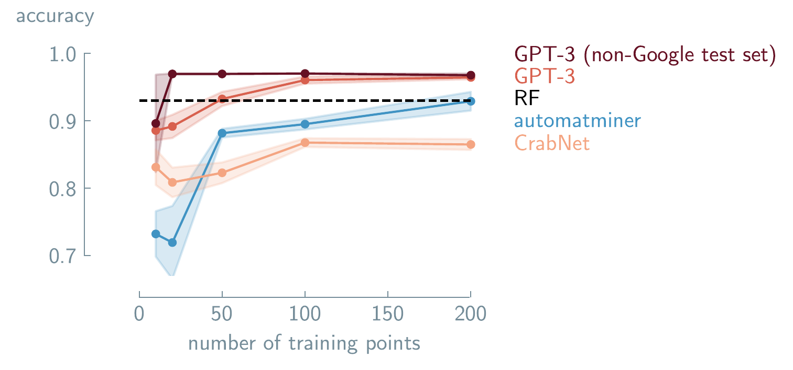
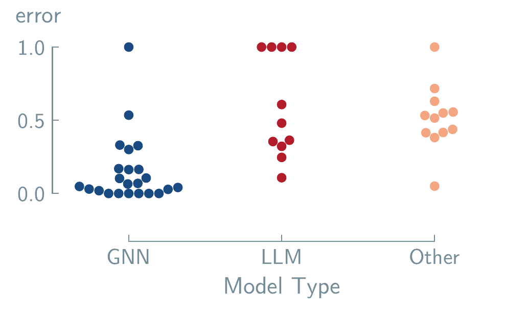
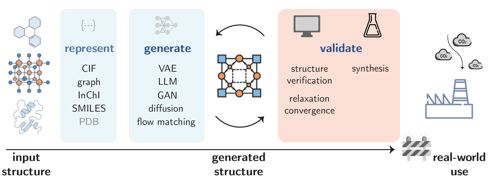
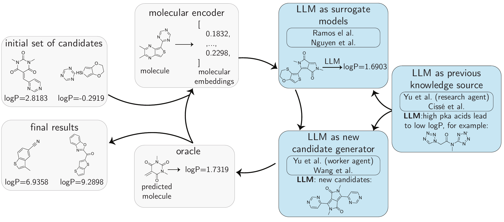

---
format:
  html:
    toc: true
    smooth-scroll: true
    anchor-sections: true
    other-links:
    - text: Visit our website
      href: https://lamalab.org/
      icon: globe
    - text: Follow us on X (Twitter)
      href: https://x.com/jablonkagroup
      icon: twitter-x
    - text: We are hiring!
      href: https://forms.fillout.com/t/eoGA7AhnAKus
      icon: person-badge
    - text: Contact us
      href: mailto:contact@lamalab.org
      icon: mailbox
acronyms:
  insert_loa: false 
  insert_links: false  
  fromfile: ./acronyms.yml
---

# Accelerating Applications

## Property Prediction {#sec-prediction}

\acr{gpm}s have emerged as
a tool for predicting molecular and material properties. Current
examples of \acr{gpm}-driven property prediction span both
classification and regression from standardized benchmarks such as
`MoleculeNet` \[@wu2018moleculenet\], to curated datasets targeting
specific applications such as antibacterial activity
\[@chithrananda2020chemberta\] or photovoltaic efficiency
\[@aneesh2025semantic\].

Three key methodologies have been explored to adapt these models for
property prediction: prompting techniques (see @sec-prompting), fine-tuning (see @sec-fine-tuning) on domain-specific data, and
\acr{rag} (see @sec-rag)
approaches that combine models with external knowledge bases.

::: {#tbl-property_prediction_models}

| Model                                                         | Property                             | Dataset                                         | Approach | Task |
|:--------------------------------------------------------------|:-------------------------------------|:------------------------------------------------|:---------|------|
| **LLM-Prop** [@rubungo_llm-prop_2023]                         | Band Gapj                            | CrystalFeatures-MP2022 [@rubungo_llm-prop_2023] | P        | R    |
|                                                               | Volume                               | CrystalFeatures-MP2022 [@rubungo_llm-prop_2023] | P        | R    |
|                                                               | Band Gap                             | CrystalFeatures-MP2022 [@rubungo_llm-prop_2023] | P        | C    |
| **LLM4SD** [@zheng2025large]                                  | Blood-brain Barrier Penetration      | BBBP [@sakiyama_prediction_2021]                | P        | C    |
|                                                               | FDA Approval                         | ClinTox [@wu2018moleculenet]                    | P        | C    |
|                                                               | Toxicology                           | Tox21 [@richard_tox21_2021]                     | P        | C    |
|                                                               | Drug-related Side Effects            | SIDER [@kuhn_sider_2016]                        | P        | C    |
|                                                               | HIV Replication Inhibition           | HIV [@wu2018moleculenet]                        | P        | C    |
|                                                               | β-secretase Binding                  | BACE [@wu2018moleculenet]                       | P        | C    |
|                                                               | Solubility                           | ESOL [@wu2018moleculenet]                       | P        | R    |
|                                                               | Hydration Free Energy                | FreeSolv [@mobley_freesolv_2014]                | P        | R    |
|                                                               | Lipophilicity                        | Lipophilicity [@wu2018moleculenet]              | P        | R    |
|                                                               | Quantum Mechanics                    | QM9 [@wu2018moleculenet]                        | P        | R    |
| **Domain Knowledge Prompt-Engineering** [@liu2025integrating] | Crystal                              | Custom [@liu2025integrating]                    | P        | C, R |
|                                                               | Organic Small Molecules              | PubChem                                         | P        | C, R |
|                                                               | Enzymes                              | UniProt                                         | P        | C, R |
| **Molecular GPT** [@liu2024moleculargpt]                      | β-secretase Binding                  | BACE [@wu2018moleculenet]                       | P        | C    |
|                                                               | HIV Replication Inhibition           | HIV [@wu2018moleculenet]                        | P        | C    |
|                                                               | Bioactivity                          | MUV [@rohrer2009maximum]                        | P        | C    |
|                                                               | Toxicology                           | Tox21 [@richard_tox21_2021]                     | P        | C    |
|                                                               | Toxicology                           | ToxCast [@us2015toxicity]                       | P        | C    |
|                                                               | Blood-brain Barrier Penetration      | BBBP [@sakiyama_prediction_2021]                | P        | C    |
|                                                               | Cytochrome P450 isozymes             | CYP450 [@ni2025curated]                         | P        | C    |
|                                                               | Solubility                           | ESOL [@wu2018moleculenet]                       | P        | R    |
|                                                               | Hydration Free Energy                | FreeSolv [@mobley_freesolv_2014]                | P        | R    |
|                                                               | Lipophilicity                        | Lipophilicity [@wu2018moleculenet]              | P        | R    |
| **GPT-MolBERTa** [@balaji2023gptmolberta]                     | Blood-brain Barrier Penetration      | BBBP [@sakiyama_prediction_2021]                | P        | C    |
|                                                               | Toxicology                           | Tox21 [@richard_tox21_2021]                     | P        | C    |
|                                                               | Toxicology                           | ToxCast [@us2015toxicity]                       | P        | C    |
|                                                               | FDA Approval                         | ClinTox [@wu2018moleculenet]                    | P        | C    |
|                                                               | Solubility                           | ESOL [@wu2018moleculenet]                       | P        | R    |
|                                                               | Hydration Free Energy                | FreeSolv [@mobley_freesolv_2014]                | P        | R    |
|                                                               | Lipophilicity                        | Lipophilicity [@wu2018moleculenet]              | P        | R    |
|                                                               | HIV Replication Inhibition           | HIV [@wu2018moleculenet]                        | P        | C    |
|                                                               | β-secretase Binding                  | BACE [@wu2018moleculenet]                       | P        | C    |
| **GPT-Chem** [@jablonka2024leveraging]                        | HOMO/LUMO                            | QMUGs [@isert_qmugs_2022]                       | FT       | C, R |
|                                                               | Solubility                           | DLS-100 [@mitchell_dls-100_2017]                | FT       | C, R |
|                                                               | Lipophilicity                        | LipoData [@jablonka2024leveraging]              | FT       | C, R |
|                                                               | Hydration Free Energy                | FreeSolv [@mobley_freesolv_2014]                | FT       | C, R |
|                                                               | Photoconversion Efficiency           | OPV [@jablonka2024leveraging]                   | FT       | C, R |
|                                                               | Toxicology                           | Tox21 [@richard_tox21_2021]                     | FT       | C, R |
|                                                               | $\text{CO}_{2}$ Henry coeff. of MOFs | MOFSorb-H [@lin_silico_2012]                    | FT       | C, R |
| **LLaMP** [@chiang2024llamp]                                  | Bulk modulus                         | Materials Project [@riebesell2025framework]     | RAG      | R    |
|                                                               | Formation energy                     | Materials Project [@riebesell2025framework]     | RAG      | R    |
|                                                               | Electronic band gap                  | Materials Project [@riebesell2025framework]     | RAG      | R    |
|                                                               | Multi-element band gap               | Materials Project [@riebesell2025framework]     | RAG      | R    |

**Non-comprehensive list of \arc{gmp}s applied to property-prediction tasks**.The table presents different models and their applications across different molecular and materials property prediction benchmarks, showing the diversity of properties (from molecular toxicology to crystal band gaps), datasets used for evaluation, modeling approaches (prompting, fine-tuning, or retrieval-augmented generation), and task types (classification or regression.)
:::

::: tablenotes
*Key:* P = prompting; FT = fine-tuned model; RAG = retrieval-augmented generation; C = classification; R = regression
:::

### Prompting

Prompt engineering involves designing targeted instructions to guide
\acr{gpm}s in performing
specialized tasks without altering their underlying parameters. In
molecular and materials science, this strategy goes beyond simply asking
a model to predict properties. Prompting strategies for molecular
property prediction have evolved from foundational techniques like
domain-knowledge and few-shot reasoning \[@liu2025integrating\] to more
advanced methods with multi-modal frameworks that extract interpretable
rules \[@zheng2025large\] (see @tbl-property_prediction_models).

Another emerging application of \acr{llm}-based \acr{gpm}s is their use as "feature extractors", where
they generate textual or embedded representations of molecules or
materials. For instance, in materials science, @aneesh2025semantic
employed \acr{llm}s to
generate text embeddings of perovskite solar cell compositions. These
embeddings were subsequently used to train a \acr{gnn} for predicting power conversion
efficiency, demonstrating the potential of \acr{llm}s to enhance feature representation in
materials informatics.

::: {#nte-cot_prompting .callout-note title="LLM Prompt Example 1"}
**\acr{cot} Prompting**\[@srinivas2024crossmodal\]\

Prompt 1: What is the molecular structure of this chemical
\acr{smiles} string?
Could you describe its atoms, bonds, functional groups, and overall
arrangement?\

Prompt 2: What are the physical properties of this molecule, such as its
boiling point and melting point?\

...\

Prompt 14: Are there any environmental impacts associated with the
production, use, or disposal of this molecule?
:::

Similarly, in the molecular domain, @srinivas2024crossmodal used
zero-shot \acr{llm}
prompting (see @nte-cot_prompting for prompt examples) to generate
detailed textual descriptions of molecular functional groups, which are
used to train a small \acr{lm}. This \acr{lm} is used to compute text-level embeddings
of molecules. Simultaneously, they generate molecular graph-level
embeddings from \acr{smiles} string molecular graph inputs. They
finally integrate the graph and text-level embeddings to produce a
semantically enriched embedding.

### Fine-Tuning {#sec-prediction_FT}

::: {#fig-gptchem}
{width="100%"}

**Fine-tuned `GPT-3` for predicting
solid-solution formation in high-entropy alloys.** Performance
comparison of different \acr{ml} approaches as a function of
the number of training points. Results are shown for
`Automatminer` (blue), `CrabNet` transformer
(orange), fine-tuned `GPT-3` (red), with error bars showing
standard error of the mean. The non-Google test set shows the fine-tuned
`GPT-3` model tested on compounds without an exact Google
search match (dark red). The dashed line shows performance using random
forest (RF). `GPT-3` achieves comparable accuracy to
traditional approaches with fewer training examples. Data adapted from
Jablonka @jablonka2024leveraging. Copyright 2024 Jablonka et
al./Springer Nature.
:::

#### \acr{lift}

@dinh2022lift showed that reformulating regression and classification
as \acr{qa} tasks enables
the use of an unmodified model architecture while improving performance
(see @sec-fine-tuning for a deeper discussion of
\acr{lift}). In
recognizing the scarcity of experimental data and acknowledging the
persistence of this limitation, @jablonka2024leveraging designed a
\acr{lift}-based
framework using `GPT-3` fine-tuned on task-specific small datasets (see @tbl-property_prediction_models). They demonstrated that
fine-tuned `GPT-3` can match or surpass specialized
\acr{ml} models in various
chemistry tasks (as shown in @fig-gptchem).

In a follow-up to @jablonka2024leveraging's work,
@vanherck2025assessment systematically evaluated this approach across
22 diverse real-world chemistry case studies using three open-source
models. They demonstrate that fine-tuned \acr{llm}s can predict various material properties.
For example, they achieved $96\%$ accuracy in predicting the adhesive
free-energy of polymers, outperforming traditional
\acr{ml} methods like
random forest ($90\%$ accuracy). The \acr{llm}s can also work with non-standard inputs,
like for predicting protein phase separation, where raw protein
sequences could be directly input without pre-processing and achieve
$95\%$ prediction accuracy. At the same time, when training datasets
were very small (15 data points), the predictive accuracy of all
fine-tuned models was lower than the random baseline (e.g., MOF
synthesis). These case studies preliminarily demonstrate that these
models can achieve predictive performance with some small datasets, work
with various chemical representations (\acr{smiles}, \acr{mof}id, and \acr{iupac} names), and can outperform traditional
\acr{ml} approaches for
some material property prediction tasks.

In the materials domain, `LLMprop` fine-tunes
`T5`\[@raffel2020exploring\] to predict crystalline material properties
from text descriptions generated by
`Robocrystallographer`\[@ganose2019robocrystallographer\]. By discarding
`T5`'s decoder and adding task-specific prediction heads, the approach
reduces computational overhead while leveraging the model's ability to
process structured crystal descriptions.

Fine-tuning has also been applied to non-\acr{llm} architectures, specifically to
\acr{ssm}s like Mamba (see @sec-example_architectures).
By pre-training on 91 million
molecules, the Mamba-based model
$\text{O}_{SMI}-{\text{SSM}-}336\textit{M}$ outperformed transformer
methods (`Yield-BERT`\[@krzyzanowski2025exploring\]) in reaction yield
prediction (e.g., Buchwald-Hartwig cross-coupling) and achieved
competitive results in molecular property prediction
benchmarks.\[@soares2025mamba-based\]

### Agents

Caldas Ramos et al. introduced `MAPI-LLM`, a framework that processes
natural-language queries about material properties using an
\acr{llm} to decide which
of the available tools, such as the Materials Project
\acr{api}, the
Reaction-Network package, or Google Search, to use to generate a
response. \[@Jablonka2023\] `MAPI-LLM` employs a
\acr{react} prompt (see @sec-arch_agents to read more about
\acr{react}), to
convert prompts such as *"Is $Fe_2O_3$ magnetic?"* or *"What is the band
gap of Mg(Fe3O3)2?"* into queries for Materials Project
\acr{api}. The system
processes multi-step prompts through logical reasoning, for example,
when asked *"If Mn2FeO3 is not metallic, what is its band gap?"*, the
\acr{llm} system creates
a two-step workflow to first verify metallicity before retrieving the
band gap.

Building on this foundation of agent-based materials querying,
@chiang2024llamp advanced the approach with `LLaMP`, a framework that
employs "hierarchical" \acr{react} agents to interact with computational and
experimental data. This "hierarchical" framework employs a
supervisor-assistant agent architecture where a complex problem is
broken down and tasks are delegated to domain-specific agents.

### Limitations {#sec-property_core_limits}

::: {#fig-property_limitations}
{width="100%"}

**Normalized error distributions for materials
property prediction models across different architectures**. Each
point represents the normalized error of a model on a specific property
prediction task. Normalization was achieved with min/max values of each
dataset to produce a range of errors between 0 and 1. The first column
(blue) shows \acr{gnn} based models, the second
column (red) displays \acr{llm} approaches, and the third
column (orange) represents other baseline methods and \acr{sota}
models, including `CrabNet`. [@Wang_2021] Lower values
indicate better predictive performance. Data adapted from
@alampara2024mattext. 
:::

A significant challenge for \acr{gpm}s in chemistry lies in managing dataset
limitations and selecting appropriate chemical representations.
Practical applications often suffer from highly unbalanced datasets,
where examples of optimal materials are vastly outnumbered by
poor-performing ones, forcing difficult compromises that can diminish
model performance \[@vanherck2025assessment\]. The choice of how a
material is represented (\acr{smiles} notation versus
\acr{iupac}) also
critically impacts performance, indicating that data preprocessing
remains a crucial consideration.

Beyond data issues, architectural constraints present another barrier as
illustrated in @fig-property_limitations. @alampara2024mattext reveal that
while \acr{llm}s are
effective for tasks relying on compositional information, they struggle
to interpret geometric or spatial data when it is encoded in text. This
suggests a fundamental limitation of transformer-based architectures for
applications requiring spatial reasoning. Consequently, the conventional
assumption that performance can be universally improved by scaling up
model size or pre-training data is challenged \[@frey2023neural\]. Such
scaling may not overcome the inherent bias against geometric
understanding.

### Open Challenges

- **Encoding 3D Structure**: Developing methods to effectively represent
  and integrate geometric, spatial, and structural information to
  overcome their inherent bias toward compositional data.

- **Dynamic Knowledge Integration**: Move beyond static fine-tuning to
  establish a reliable, real-time framework that can incorporate new,
  evolving scientific findings without catastrophic forgetting.

- **Fundamental Architectural Shifts**: Exploring whether many of the
  existing \acr{gpm}
  architectures are sufficient or if new, specialized ones are needed to
  capture complex relationships in molecular and materials science.

## Molecular and Material Generation {#sec-mol_generation}

::: {#fig-generation}
{width="100%"}

**Pipeline for molecular and materials
generation**. The workflow begins with input structures
represented in various formats, which are used to train \acr{ml}
models to generate novel molecular and material structures. The
generated structures should undergo a feedback loop through validation
processes before being applied in the real world. Blue boxes indicate
well-established areas of the pipeline with mature methodologies, while
the red box represents critical bottlenecks. Currently, the largest gaps
in the process are in the representation and validation
steps.
:::

Early work in molecular and materials generation relied heavily on
unconditional generation, where models produce novel structures without
explicit guidance. These methods excel at exploring chemical space
broadly but lack specific control. Conditional generation, in contrast,
uses explicit prompts or constraints (e.g., property targets, structural
fragments) to steer \acr{gpm}s toward meaningful molecule or material
designs. Beyond the generation step, as @fig-generation
shows, critical bottlenecks persist in
synthesizability and physical consistency at the validation stage.

### Generation {#sec-generation}

#### Prompting

While zero-shot and few-shot prompting strategies offer a flexible
approach to molecule generation, benchmark studies \[@guo2023large\]
reveal a significant performance gap compared to specialized models.
@guo2023large systematically evaluated \acr{llm}s like `GPT-4`, finding that while they could
generate syntactically valid molecules ($89\%$ validity), their accuracy
in meeting specific property targets was low ($< 20\%$). These
performance gaps highlight the lack of chemical structure-property
relationships possessed by \acr{llm}s.

#### Fine-Tuning {#sec-fine-tuning}

To overcome the limitations of prompting, fine-tuning has been adopted
in molecular and materials generation, much like its use in property
prediction with \acr{lift}-based frameworks (see @sec-fine-tuning for a deeper explanation of
\acr{lift} and @sec-prediction_FT for a discussion of
\acr{lift} applied to
property prediction tasks).

A representative example is \acr{icma}, which combines retrieval-augmented
in-context learning with fine-tuning \[@li2025large\]. This method
avoids extensive domain-specific pre-training by retrieving relevant
examples to guide the model. On standard benchmarks,
\acr{icma} nearly
doubled baseline performance for tasks like generating molecules from
text descriptions (Cap2Mol). However, its strong dependence on retrieved
examples raises questions about its ability to generalize to entirely
novel molecular scaffolds. Other fine-tuning approaches have aimed to
further improve accuracy on the "Cap2Mol" task \[@li2024molreflect;
@lin2025property\].

#### Diffusion and Flow Matching

Diffusion and flow-based generative models provide a flexible framework
for generating diverse structures by operating directly on latent
representations \[@zhu20243m-diffusion\]. A more complex challenge
involves generating crystalline materials, which require modeling both
discrete (atom type) and continuous (atomic position) variables. To
address this, hybrid architectures like `FLowLLM` have emerged,
combining the strengths of \acr{llm}s and flow matching. In this approach, a
fine-tuned \acr{llm}
learns a base distribution of crystals from text-based representations,
which is then refined through rectified flow matching to optimize the
atomic structure \[@sriram2024flowllm\].

#### Reinforcement Learning and Preference Optimization

Translating \acr{gpm}
generated outputs to the real world requires designing molecules and
materials with specific target properties. \acr{rl} and preference optimization
techniques\[@lee2024fine-tuning\] have emerged as potential solutions
for this challenge.

`CrystalFormer-RL` uses \acr{rl} fine-tuning to optimize
`CrystalFormer`\[@cao2024space\], a transformer-based crystal generator,
with rewards from discriminative models (e.g., property
predictors)\[@cao2025crystalformer-rl\]. Here, \acr{rl} fine-tuning is shown to outperform
supervised fine-tuning, enhancing both novel material discovery and
retrieval of high-performing candidates from the pre-training dataset.

\acr{era} introduces a
different optimization paradigm. \[@chennakesavalu2025aligning\] Unlike
\acr{ppo} or
\acr{dpo},
\acr{era} uses
gradient-based objectives to guide word-by-word generation with explicit
reward functions, converging to a physics-inspired probability
distribution that allows fine control over the generation process.

#### Agents

Agent-based frameworks leveraging \acr{llm}s, explained in @sec-agents, have emerged as approaches for autonomous
molecular and materials generation, demonstrating capabilities that
extend beyond simple prompting or fine-tuning by incorporating iterative
feedback loops, tool integration, and human-\acr{ai} collaboration. The `dZiner` framework
exemplifies this approach for the inverse design of materials, where
agents input initial \acr{smiles} strings with optimization task
descriptions and generate validated candidate molecules by retrieving
domain knowledge from the literature.\[@ansari2024dziner\] It also uses
domain-expert surrogate models to evaluate the required property in the
new molecule/material.

### Validation

#### General validation

The most fundamental validation approaches use cheminformatics tools
like `RDKit` to verify molecular validity. More sophisticated validation
involves quantum mechanical calculations to compute molecular properties
such as formation energies\[@kingsbury2022flexible\].

The gold standard for validation is experimental synthesis, but
significant gaps exist between computational generation and laboratory
realization. Retrosynthesis prediction algorithms attempt to bridge this
gap by evaluating synthetic accessibility and proposing potential
synthesis routes (see @sec-retrosynthesis). However, these methods still face
limitations in accurately predicting real-world synthesizability
\[@zunger2019beware\].

#### Conditional Generation Validation

Beyond establishing the general validity of generated molecules,
evaluation methods can assess both their novelty relative to training
data and their ability to meet specific design goals. For inverse design
tasks, such as optimizing binding affinity or solubility, the *de novo*
molecule generation benchmark GuacaMol differentiates between
*distribution-learning* (e.g., generating diverse, valid molecules) and
*goal-directed* optimization (e.g., rediscovering known drugs or meeting
multi-objective constraints) \[@brown2019guacamol\]. In the materials
paradigm, frameworks such as `MatBench Discovery` evaluate analogous
challenges such as stability, electronic properties, and
synthesizability, but adapt metrics to periodic systems, such as energy
above hull or band gap prediction accuracy\[@riebesell2025framework\].

### Limitations 

Current generative pipelines for molecules and materials, as illustrated
in @fig-generation, face significant bottlenecks that limit
their immediate real-world application. A primary limitation is the
performance gap in conditional generation; while methods like
fine-tuning and reinforcement learning have improved control,
\acr{llm}s often lack the
inherent chemical understanding to accurately meet specific property
targets. Furthermore, the validation stage remains a critical challenge.
Even when a structure is computationally valid, assessing its
synthesizability and physical consistency relies heavily on
approximations, with a significant gap remaining between in-silico
prediction and experimental realization.

### Open Challenges

- **Robust Conditional Generation** Developing models that can reliably
  generate novel, diverse structures that satisfy complex,
  multi-objective constraints (e.g., high stability, specific electronic
  properties, and synthesizability) without over-relying on retrieved
  training data examples.

- **Bridging the Synthesis Gap** Creating new validation metrics that
  better predict the synthetic feasibility of generated materials and
  molecules, moving beyond structural similarity toward realistic
  pathway prediction.

- **Unified Multi-Scale Generation** Developing frameworks that are
  capable of simultaneously modeling different representations (e.g.,
  text, graphs, 3D structures) and scales (e.g., from molecules to
  crystalline materials) within a single generative process

## Retrosynthesis {#sec-retrosynthesis}

The practical utility of \acr{gpm}s for molecules and materials design is
constrained by uncertainty in synthetic feasibility. Early work showed
that attention-based models learn meaningful reaction representations,
enabling accurate reaction outcome classification and prediction
\[@schwaller2021mapping\].

Building on this, generation pipelines increasingly integrate
synthesizability and retrosynthetic guidance via domain tools and
\acr{gpm}s
\[@liu2024multimodal\]. For example, @sun2025synllama adapted open
\acr{llm}s to propose
retrosynthetic routes and identify purchasable building blocks for
experimentally validated SARS-CoV-2 Mpro inhibitors.

\acr{llm}s are also being
fine-tuned as chemistry assistants for experimental guidance.
@zhang2025large used a two-stage process, supervised fine-tuning with
reaction and retrosynthesis \acr{qa} followed by \acr{rlhf} to optimize reaction conditions,
achieving an unreported Suzuki-Miyaura cross-coupling in 15 runs.

Predictive retrosynthesis has also extended to the inorganic domain.
@kim2024large demonstrated that fine-tuned `GPT-3.5`, and `GPT-4` can
predict both the synthesizability of inorganic compounds from their
chemical formulas and select appropriate precursors for synthesis,
achieving performance comparable to specialized \acr{ml} models with minimal development time and
cost.

Toward autonomy, @bran2024augmenting developed `ChemCrow`, an
\acr{llm}-based system
that autonomously plans and executes the synthesis of novel compounds by
integrating specialized tools like a retrosynthesis planner (see @sec-planning
to read more about this capability of
`ChemCrow` and its limitations) and reaction predictors. This approach
mirrors the iterative experimental design cycle employed by human
chemists, but is equipped with the scalability of automation.

### Limitations 

\acr{gpm}s inherit the
fundamental constraints associated with domain-specific models for
retrosynthesis, which primarily concern data and evaluation
methodologies. The prevailing reliance on patent-derived data introduces
a significant bias, as these datasets are dominated by a limited set of
reaction types and predominantly feature single-step examples.
Furthermore, the absence of negative results and the frequent omission
of experimental conditions can mislead model training \[@Lee2024noise;
@Voinarovska2023when; @Saebi2023onthe; @Maloney2023negative;
@Tadanki2025dissecting\]. The evaluation paradigms suffer from a
parallel shortcoming, as they are largely designed for single-step
routes and fail to adequately capture the complexities of real-world,
multi-step case studies \[@TorrenPeraire2024models; @maziarz2025re;
@liu2024evaluating\].

A further significant challenge is data leakage. The vast scale of data
used for training these models often leads to saturated benchmarks,
where high performance may reflect memorization rather than genuine
generalization.

Finally, while standalone \acr{gpm}s shows limited efficacy for multi-step
retrosynthesis, its integration into agentic frameworks introduces a
distinct set of limitations. Current evaluations are poorly suited to
assess the critical components of such systems, such as planning,
reasoning, and tool-calling capabilities. The focus remains
predominantly on final answer correctness, which impedes large-scale
optimization and correction of agents without extensive human oversight,
typically resulting in the use of a fragile and error-prone
LLM-as-Judge.

These evaluation gaps, combined with the inherent limitations in
long-term planning and chemical understanding of the underlying
\acr{llm}s, present
substantial obstacles to the development and practical application of
agentic systems for this retrosynthetic task.

### Open Challenges

- **Data Quality and Bias**: To build more robust and generalizable
  models, the field must integrate higher-quality data from
  peer-reviewed scientific literature. This requires the development of
  standardized extraction schemas and data cleaning protocols to create
  a balanced and reliable training corpus \[@rios2025llm;
  @mehr2020universal\].

- **Robust and Meaningful Evaluation**: There is a critical need for
  evaluation methodologies that prevent data leakage and test genuine
  model understanding. Benchmarks must be designed to go beyond
  memorization, instead probing a model's capacity for chemical
  reasoning, generalization to novel structures, and robust
  problem-solving.

- **Benchmarking Complex Planning**: Truly assessing a
  \acr{gpm}'s utility
  requires benchmarks that mirror real-world complexity. This involves
  evaluating performance in open-ended retrosynthetic planning and
  developing frameworks that assess a model's sequential
  decision-making.

## GPMs as Optimizers {#sec-llm-optimizers}

::: {#fig-optimization}
{width="100%"}

**Overview of the iterative optimization loop that
mirrors the structure of the optimization section**. The blue
boxes contain the different roles that the \acr{llm}s
play in the loop, and which are described in the main text. References
in which the use of \acr{llm}s for that step are detailed
inside the small boxes inside each of the components of the loop. The
example shown is about obtaining molecules with high
`logP`.
:::

Discovering novel compounds and reactions in chemistry and materials
science has long relied on iterative trial-and-error processes rooted in
existing domain knowledge \[@Taylor2023brief\]. As noted in @sec-retrosynthesis, these methods accelerate discovery, and
optimization targets variables such as conditions or binding affinity.
Nevertheless, the overall process remains slow and labor-intensive.
Traditional data-driven methods aim to address these limitations by
combining predictive \acr{ml} models with optimization frameworks such
as \acr{bo} or
\acr{ea}s. These frameworks
balance exploration of uncharted regions in chemical space with
exploitation of known high-performing regions \[@Li2024sequential;
@Hse2021gryffin; @Shields2021bayesian; @Griffiths2020constrained;
@RajabiKochi2025adaptive\].

Recent advances in \acr{llm}s have been explored for targeting
optimization challenges in chemistry and related domains
\[@fernando2023promptbreeder0; @yang2023large; @chen2024instruct\]. A
commonly referenced advantage is that \acr{llm}s may process optimization tasks posed in
natural language, which may facilitate knowledge incorporation,
candidate comparison, and interpretability in some settings. This can
align with chemical problem-solving, where complex phenomena, such as
reaction pathways or material behaviors, are often poorly captured by
standard nomenclature; however, they can still be intuitively explained
through natural language. Moreover, \acr{gpm}s can offer flexibility when problem
definitions change, whereas many classical models require retraining.
Encoding domain-specific knowledge---including reaction rules,
thermodynamic principles, and structure-property relationships---into
structured prompts may allow \acr{llm}s to complement domain expertise with their
ability to navigate complex chemical optimization problems.

Current \acr{llm}
applications in chemistry optimization vary in scope and methodology.
Many studies integrate \acr{llm}s into \acr{bo} frameworks, where models guide
experimental design by predicting promising candidates
\[@rankovic2023bochemian\]. Others employ \acr{ga}s or hybrid strategies that combine
\acr{llm}-generated
hypotheses with computational screening \[@cisse2025language0based\].

### LLMs as Surrogate Models

A prominent \acr{llm}-driven strategy positions these models as
surrogate models within optimization loops \[@yu2025collaborative\].
Surrogate models---often implemented as \acr{gpr}---learn from prior data to approximate
costly feature-outcome landscapes, which are often computationally
expensive and time-consuming to evaluate, thereby guiding the
acquisition. A proposed advantage of the \acr{llm}s in this role is relatively better low-data
performance compared to classical \acr{ml} optimization methods. Their
\acr{icl} capability
enables task demonstration with minimal prompt examples while leveraging
chemical knowledge from pre-training to generate accurate predictions.
This allows \acr{llm}s to
compensate for sparse experimental data effectively. However,
\acr{llm}s are less robust
than \acr{gpr} due to
their tendency to hallucinate.

@ramos2023bayesian demonstrated the use of this low-data regime through
a framework that combines \acr{icl} using only one example in the prompt with
a \acr{bo} workflow. Their
\acr{bo}-\acr{icl} approach uses $k$-shot examples formatted
as question-answer pairs, where the \acr{llm} generates candidate solutions conditioned
on prior successful iterations. These candidates are ranked using an
acquisition function, with top-$k$ selections integrated into subsequent
prompts to refine predictions iteratively. Interestingly, in the
reported experiments, the method performed competitively, matching top-1
accuracies on the evaluated benchmarks compared to classical
\acr{bo} methods. This
emphasizes the potential of \acr{llm}s as accessible, \acr{icl} optimizers when coupled with
well-designed prompts.

Trying to address limitations in base \acr{llm}s' inherent chemical knowledge---particularly
their grasp of specialized representations like
\acr{smiles} or
structure-property mappings---@yu2025collaborative introduced a hybrid
architecture augmenting pre-trained \acr{llm}s with task-specific embedding and prediction
layers. These layers, fine-tuned on domain data, aligned latent
representations of input-output pairs (denoted as `<x>` and `<y>` in
prompts), enabling the model to map chemical structures and properties
into a unified, interpretable space. Crucially, the added layers were
reported to improve chemical reasoning without sacrificing the
flexibility of \acr{icl},
allowing the system to adapt to trends across iterations, similarly to
what was done by @ramos2023bayesian. In their evaluations of molecular
optimization benchmarks, such as the \acr{pmo} \[@gao2022sample\], they revealed that
\acr{llm}-based methods
matched or improved over conventional methods, including
\acr{bo}-\acr{gp}, \acr{rl} methods, and \acr{ga}.

### LLMs as Next Candidate Generators

Recent studies explore the possibility of using
\acr{llm}s in enhancing
\acr{ea}s
\[@lu2024generative\] and \acr{bo} \[@amin2025towards\] frameworks by
leveraging their embedded chemical knowledge and ability to integrate
prior information, thereby potentially reducing computational effort
while improving output quality \[@lu2024generative\]. Within
\acr{ea}s,
\acr{llm}s refine molecular
candidates through mutations (modifying molecular substructures) or
crossovers (combining parent molecules). In \acr{bo} frameworks, they serve as acquisition
policies, utilizing surrogate model predictions---both mean and
uncertainty---to select optimal molecules or reaction conditions for
evaluation.

For molecule optimization, @yu2025collaborative introduced `MultiMol`,
a dual-\acr{llm} system
where one model proposes candidates and the other supplies domain
knowledge (see @sec-opt-llm-know-source). By fine-tuning the "worker"
\acr{llm} to recognize
molecular scaffolds and target properties, and expanding the training
pool to include a pre-training dataset of $\sim1$ million samples, they
report hit rates (percentage of generated molecules that meet the target
properties under a certain threshold) exceeding $90\%$ on their
evaluation set.

Similarly, @wang2024efficient developed `MoLLEO`, integrating an
\acr{llm} into an
\acr{ea} to replace random
mutations with \acr{llm}-guided modifications. Here, `GPT-4`
generated optimized offspring from parent molecules that converged
faster to high fitness scores in the reported experiments. Notably,
while domain-specialized models (`BioT5`, `MoleculeSTM`) underperformed,
the general-purpose `GPT-4` excelled---suggesting the utility of
\acr{llm}s may be
context-dependent.

### LLMs as Prior Knowledge Sources {#sec-opt-llm-know-source}

A key advantage of integrating \acr{llm}s into optimization frameworks is their
ability to encode and deploy prior knowledge within the optimization
loop. As illustrated in @fig-optimization, this knowledge can be directed into
either the surrogate model or candidate generation module, potentially
reducing the number of optimization steps required through high-quality
guidance if the feedback is useful.

For example, @cisse2025language0based introduced `BORA`, which
contextualizes conventional black-box \acr{bo} using an \acr{llm}. `BORA` maintains standard
\acr{bo} as the core
driver, but strategically activates the \acr{llm} when progress stalls. This leverages the
model's \acr{icl}
capabilities to hypothesize promising search regions and propose new
samples, regulated by a lightweight heuristic policy that manages costs
and incorporates domain knowledge (or user input). Evaluations on
synthetic benchmarks, such as optimizing the catalyst mixture for
hydrogen generation, show that `BORA` was reported to accelerate
exploration, and outperforms the \acr{llm}-\acr{bo} hybrid methods evaluated.

To potentially enhance the task-specific knowledge of the
\acr{llm} generating
feedback, @zhang2025large fine-tuned a `Llama-2-7B` model using a
multitask \acr{qa}
dataset. This dataset was created with instructions from `GPT-4`. The
resulting model served as a human assistant or operated within an active
learning loop, thereby accelerating the exploration of new reaction
spaces (see sec-retrosynthesis). However, as the authors note, even
this task-specialized \acr{llm} produces suboptimal suggestions for
optimization tasks. They remain prone to hallucinations and cannot
assist with unreported reactions, but still improved upon pure classical
methods in most of the evaluated applications.

### Approaching Optimization Problems

Published works explore different ways of using
\acr{llm}s for optimization
problems in chemistry, from simple approaches, such as just prompting
the model with some initial random set of experimental candidates and
iterating \[@ramos2023bayesian\], to fine-tuning models in
\acr{bo} fashion
\[@rankovic2025gollum0\]. A pragmatic initial step is to try a purely
\acr{icl} approach, which
allows one to obtain a first signal rapidly. Such results help determine
whether a more complex, computationally intensive approach is necessary
or whether prompt engineering is reliable for the application.
Fine-tuning can be used as a way to enhance the chemical knowledge of
the \acr{llm}s and can lead
to improvements in optimization tasks where the model requires such
knowledge to choose or generate better candidates. Fine-tuning might not
be a game-changer for other approaches that rely more on sampling
methods \[@wang2025llm0augmented\].

While some initial works showed that \acr{llm}s trained specifically on chemistry perform
better for optimization tasks \[@kristiadi2024sober\], other works
showed that a \acr{gpm}s
such as `GPT-4` combined with an \acr{ea} outperformed all other models
\[@wang2024efficient; @macknight2025pre0trained\].

### Limitations

Current \acr{llm}s for
chemical optimization, to date, exhibit a pronounced volatility, rarely
yielding stable performance gains. Their outcomes are highly sensitive
to prompt phrasing, and a lack of calibrated uncertainty estimates
prevents their use for principled acquisition strategies.
\[@liu2024large\] Furthermore, these models frequently produce
hallucinations and violate critical constraints, leading to invalid
chemical structures or the proposal of unsafe and infeasible
experimental conditions. Alleged improvements often hinge on narrow
benchmarks, extensive pre- and post-processing, or access to downstream
oracles, rather than on robust chemical reasoning. Within hybrid
pipelines, the specific contribution of the \acr{llm} becomes difficult to isolate.

### Open Challenges

- **Correct Prompt Sensitivity**: A key challenge is achieving prompt
  invariance, where the ranking of candidates remains stable under
  controlled rephrasings. Promising research directions include
  developing rigorous invariance tests and moving beyond discrete tokens
  to leverage models' more stable hidden states
  \[@rankovic2025gollum0\].

- **More robust evaluations**: Future work should develop more robust
  frameworks that assess oracle realism, conduct thorough leakage audits
  to detect data contamination, and integrate uncertainty-aware metrics
  to better quantify risk and reliability.

- **Ablations for the specific LLM role**: There is a critical need for
  systematic ablation studies that isolate core
  \acr{llm} performance
  from enhancements like \acr{rag}, external scorers, or tool use. Such
  studies are essential for fairly comparing general and fine-tuned
  \acr{llm}s and for
  understanding the source of performance gains.
