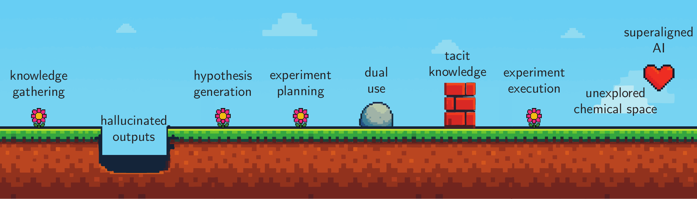

---
format:
  html:
    toc: true
    smooth-scroll: true
    anchor-sections: true
    other-links:
    - text: Visit our website
      href: https://lamalab.org/
      icon: globe
    - text: Follow us on X (Twitter)
      href: https://x.com/jablonkagroup
      icon: twitter-x
    - text: We are hiring!
      href: https://forms.fillout.com/t/eoGA7AhnAKus
      icon: person-badge
    - text: Contact us
      href: mailto:contact@lamalab.org
      icon: mailbox
acronyms:
  insert_loa: false 
  insert_links: false  
  fromfile: ./acronyms.yml
---

# Implications of GPMs: Education, Safety, and Ethics {#sec-implications}

As \acr{gpm}s integrate
into chemistry education and research, they bring transformative
potential alongside critical challenges. Responsible deployment requires
addressing pedagogical practices, chemical-specific safety risks, and
ethical considerations unique to scientific knowledge systems.

## Education {#sec-education}

\acr{gpm}s open up
potential for chemistry education, ranging from personalized tutoring
and adaptive feedback to supporting educators in material preparation
and assessment. \[@Mollick2024\] Specialized systems could tailor
explanations to individual learning needs, help students rehearse
concepts, and lower barriers to coding and data analysis.\[@Mollick2024;
@Sharma2025role; @Du2024\] Coupled with \acr{ar}, they could provide safe laboratory
simulations before physical experiments. For educators,
\acr{gpm}s promise to
reduce workload through automated feedback on open-ended responses and
individualized assignment generation.\[@Kortemeyer2024;
@gao2024towards\]

Despite this potential, current implementations remain fragmented. Most
uses rely on general-purpose interfaces without curricular
alignment\[@Subasinghe2025; @Tsai2023; @shao2025unlocking\], and while
first prototypes integrate \acr{gpm}s into structured systems with
\acr{rag}
\[@perez2025large; @Jablonka2023\], learning tracking, or interactive
tutoring modes \[@li2025tutorllm0; @wang2025learnmate0;
@AnthropicEducation\], chemistry-focused platforms are rare. Studies
further suggest that while models can handle simple recall or formatting
tasks, they struggle with deeper reasoning, diagram interpretation, and
robust grading.\[@handa2025education; @baral2025drawedumath0;
@kharchenko2024advantages\]

### Limitations

\acr{gpm}s lack
transparency in sources and confidence, enabling hallucinations to
mislead students.\[@marcus2025will; @kosmyna2025your\] Over-reliance
risks deskilling: students complete assignments without developing
chemical understanding or analytical thinking.\[@dung2025learning;
@Sharma2025role\] Models are unreliable for grading chemistry work,
particularly free-text reasoning and molecular
diagrams.\[@baral2025drawedumath0; @Kortemeyer2024\]

### Open Challenges

- **Responsible Integration Strategies.** Developing pedagogical
  frameworks for thoughtful \acr{gpm} integration in chemistry curricula,
  adapting assessment to emphasize critical evaluation over rote
  completion.

- **Chemistry-Specific Systems.** Building platforms that integrate
  chemical structure recognition, spectroscopic data interpretation, and
  laboratory safety protocols into tutoring and assessment workflows.

- **Critical Competence Training.** Teaching students to evaluate
  chemical plausibility, identify hallucinated reactions, and creatively
  extend model outputs.\[@klein2025rethink\]

- **Validated Assessment Tools.** Developing robust grading systems for
  chemistry-specific tasks: mechanism proposals, spectral
  interpretation, synthesis planning.

## Safety {#sec-safety}

::: {#fig-safety-overview}
{width="100%"}

**A conceptual schematic depicting \acr{ai}
risk factors in chemical science**. As one traverses through the
scientific process, illustrated as a game, there are various obstacles
to encountering \acr{ai} exacerbated risks. The path
to superaligned chemical \acr{ai}-assistants is obfuscated by
unexplored chemical space.
:::

\acr{gpm}s in chemistry are
double-edged: they accelerate discovery while potentially amplifying
chemical safety risks. From democratizing hazardous synthesis knowledge
to enabling autonomous dangerous compound production, these systems
lower barriers to misuse
(@fig-safety-overview). Real-world constraints---specialized
equipment, regulated reagents, tacit expertise---currently limit risks,
but \acr{gpm}s are
progressively overcoming these barriers.

### Chemical-Specific Risk Amplification

#### Information Access and Synthesis Planning

\acr{gpm}s can lower
cognitive barriers to accessing dangerous chemical knowledge.
@urbina2022dual demonstrated that molecular generators like `MegaSyn`
could design toxic agents including VX when reward functions prioritize
toxicity. Recent evaluations of `GPT-4` and `Claude 4 Opus` for
biological threat creation found that while information is already
accessible, \acr{gpm}s
improve troubleshooting and help acquire tacit knowledge previously
limiting non-experts.\[@openai2024building; @anthropic2025system\]
@he2023control showed \acr{llm}s generate pathways for explosives
(\acr{petn}) and nerve
agents (sarin). While precursor supply chains remain regulated,
\acr{gpm}s that
incrementally lower technical barriers act as force multipliers for
malicious actors. Chemistry-specific agents like
`ChemCrow`\[@bran2024augmenting\] and
`Coscientist`\[@boiko2023autonomous\] demonstrate how
\acr{gpm}s can plan and
execute complex syntheses---capabilities extending to dangerous
compounds.

#### Hallucinations in Chemical Contexts

\acr{gpm}s can hallucinate
non-existent reactions, falsify safety protocols, and generate
plausible-sounding but incorrect procedures.\[@pantha2024challenges;
@ji2023survey\] In chemistry, these errors risk laboratory accidents or
synthesis failures that waste resources. Temporal misalignment due to
static training data means chemical knowledge becomes outdated as new
reactions, hazards, and regulations emerge.

#### Autonomous Laboratory Risks

Autonomous laboratories controlled by \acr{gpm}s face cybersecurity vulnerabilities.
Compromised systems could be manipulated to synthesize hazardous
compounds. The timeline mismatch between \acr{ai} capabilities and infrastructure security
creates risk windows where adversaries exploit inadequately protected
systems.\[@rouleau2025risks; @dean2025security\]

### Existing Approaches to Safety

Red-teaming evaluations identify vulnerabilities but are reactive, not
preventive. `ChemCrow`'s safeguards block known controlled substances,
yet @he2023control demonstrated these protections rely on post-query
web searches rather than embedded constraints---easily circumventable.
Machine unlearning attempts to remove hazardous knowledge face
fundamental challenges in chemistry: defining "dangerous chemical
knowledge" is context-dependent (bleach is benign alone, hazardous when
combined), and removal risks degrading model utility for legitimate
research. Alignment through \acr{rlhf} reduces harmful outputs but remains
vulnerable to jailbreaks\[@kuntz2025os-harm; @yona2024stealing;
@lynch2025agentic\] and fails to generalize to novel threats (models
might refuse known toxins while suggesting precursors).

### Solutions

Chemical \acr{gpm}
oversight should focus on "advanced chemical models" meeting specific
risk thresholds: models trained on sensitive synthesis data, systems
demonstrating autonomous synthesis planning capabilities, or agents with
laboratory control interfaces. This targeted approach avoids burdening
low-risk research while capturing concerning systems---analogous to
proposed biological model regulations.\[@bloomfield2024ai\]

Developing chemistry-aware guardrails requires systems that evaluate
chemical plausibility, safety, and regulatory compliance before
providing synthesis information. These technical safeguards should
integrate real-time hazard assessment checking outputs against
controlled substance databases, context-aware refusal mechanisms
understanding legitimate versus dangerous use cases, precursor tracking
identifying suspicious synthesis pathway queries, and audit logging
enabling forensic analysis of concerning interactions. Establishing
review processes for \acr{gpm}-assisted chemical research analogous to
institutional biosafety committees provides essential institutional
oversight. Researchers deploying chemical \acr{gpm}s with autonomous capabilities should undergo
safety review, particularly for autonomous synthesis planning and
execution, large-scale screening for bioactive compounds, or novel
chemical class exploration without expert oversight.

International coordination remains critical for effective chemical
\acr{gpm} governance.
Unlike self-regulation, which risks conflicts of interest and
competitive pressure toward laxity, an international oversight
body---analogous to organizations governing nuclear materials or
biological weapons---could harmonize safety standards across
jurisdictions. Such an \acr{iaio} comprising \acr{ai} researchers, chemists, policymakers, and
security experts could establish pre-approval requirements for high-risk
chemical \acr{gpm}
development, similar to institutional review boards in biomedical
research.\[@trager2023international\] Precedents exist in
\acr{cern}'s approach to
balancing civilian research with dual-use risk management and nuclear
non-proliferation treaties tying market access to compliance.

Transparency requirements should mandate that chemical
\acr{gpm} developers
publicly report red-teaming results for dangerous synthesis queries,
safety evaluation methodologies and thresholds, known vulnerabilities
and mitigation strategies, and training data sources documenting
chemical knowledge scope. The fundamental tension remains:
\acr{gpm}s optimize
reactions or design toxins with equal facility, but their black-box
nature complicates accountability. Progress requires not just safeguards
but deliberate constraints on chemical \acr{gpm} capabilities in high-risk domains.

## Ethics {#sec-ethics}

\acr{gpm} deployment in
chemistry raises ethical concerns requiring careful consideration: from
bias in chemical knowledge to environmental costs of
computation.\[@crawford2021atlas\]

### Environmental Impact of GPMs

The computational requirements for training and deploying
\acr{gpm}s contribute to
environmental degradation through excessive energy consumption and
carbon emissions. \[@spotte-smith2025considering; @nature2023carbon\]
These computational resources are often powered by fossil fuel-based
energy sources, which directly contribute to anthropogenic climate
change. \[@strubell2019energy\] The emphasis on \acr{ai} research has superseded some commitments
made by big technological companies to carbon neutrality. For example,
Google rescinded its commitment to carbon neutrality amid a surge in
\acr{ai} usage (65$\%$
increase in carbon emissions between 2021--24) and
funding.\[@bhuiyan2025google\] Additionally, the water consumption for
cooling data centers that support these models is another concern,
particularly in regions facing water scarcity. \[@mytton2021data\]

The irony is particularly stark when considering that in the chemical
sciences, these models are used to address climate-related challenges,
such as the development of sustainable materials or carbon capture
technologies. As a scientific community, we must grapple with the
questions about the sustainability of current \acr{ai} development trajectories and consider
more efficient and renewable approaches to model development and
deployment. \[@kolbert2024obscene\]

### Copyright Infringement and Plagiarism Concerns

\acr{gpm}s are typically
trained on a vast corpora of copyrighted scientific literature, patents,
and proprietary databases, often without explicit permission, a practice
that has sparked legal disputes, such as *Getty Images v. Stability
\acr{ai}*, where
plaintiffs allege unauthorized scraping of protected content.
\[@kirchhubel2024intellectual\] Developers at `OpenAI` claimed in a
statement to the \acr{uk}
House of Lords that training \acr{sota} models is "impossible" without
copyrighted material, highlighting a fundamental tension between
\acr{ip} law and
\acr{ai} advancement.
\[@openai2023written\] In the chemical sciences, this challenge persists
through the training of models on experimental results from pay-walled
journals. A potential resolution to this in the scientific sphere lies
in the expansion of open-access research frameworks. Initiatives like
the \acr{cas} Common
Chemistry database provide legally clear training data while maintaining
attribution. \acr{llm}s
have shown a high propensity to regurgitate elements from their training
data. When generating text, models may reproduce near-verbatim fragments
of training data without citation, effectively obscuring intellectual
contributions.\[@bender2021dangers\] While some praise
\acr{gpm}s for overcoming
"blank-page syndrome" for early-career scientists
\[@altmae2023artificial\], others warn that uncritical reliance on their
outputs risks eroding scientific rigor.\[@donker2023dangers\]

### Biases

\acr{gpm}s inherit and
amplify harmful prejudices and stereotypes present in their training
data, which pose significant risks when applied translationally to
medicinal chemistry and biochemistry. \[@spotte-smith2025considering;
@yang2024demographic; @omiye2023large\] These models can perpetuate
inaccurate and harmful assumptions based on race and gender about drug
efficacy, toxicity, and disease susceptibility, leading to misdiagnosis
and mistreatment. \[@chen2023algorithmic\] Historical medical literature
contains biased representations of how different populations respond to
treatments, and \acr{gpm}s
trained on such data can reinforce these misconceptions.
\[@mittermaier2023bias\] The problem extends to broader contexts in
chemical research. Biased models can influence research priorities,
funding decisions, and the development of chemical tools in ways that
systematically disadvantage the most vulnerable populations
\[@dotan2019value0laden\].

#### Solutions

The problem of bias can be best addressed through top-down reform. The
data necessary to train unbiased models can only exist if clinical
studies of drug efficacy are conducted on diverse populations in the
real world.\[@criado-perez2019invisible\] To complement improved data
collection, standard evaluations for bias testing must be developed and
mandated prior to deployment of \acr{gpm}s.

### Access and Power Concentration

Although \acr{gpm}s have
the potential to democratize access to advanced chemical research
capabilities, they may also concentrate power in the hands of a few
large companies that control the frontier models. This concentration
raises concerns about equitable access to research tools, particularly
for researchers in smaller institutions with limited
resources.\[@satariano2025a1i1\]

As a community, we should ensure that the benefits of
\acr{gpm}s in chemistry
remain broadly accessible via public compute, open-weight models, and
portable tooling. We should also insist on fair access terms and
transparent benchmarks so that no single provider can gatekeep core
research.
