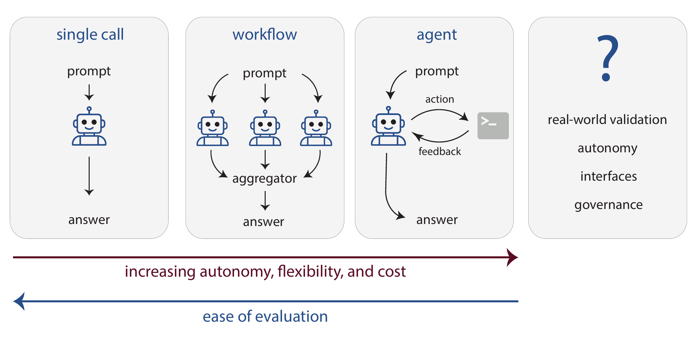

---
format:
  html:
    toc: true
    smooth-scroll: true
    anchor-sections: true
    other-links:
    - text: Visit our website
      href: https://lamalab.org/
      icon: globe
    - text: Follow us on X (Twitter)
      href: https://x.com/jablonkagroup
      icon: twitter-x
    - text: We are hiring!
      href: https://forms.fillout.com/t/eoGA7AhnAKus
      icon: person-badge
    - text: Contact us
      href: mailto:contact@lamalab.org
      icon: mailbox
acronyms:
  insert_loa: false 
  insert_links: false  
  fromfile: ./acronyms.yml
---

# Outlook and Conclusions

::: {#fig-conclusions}
{width="100%"}

**Evolution of \acr{gpm}-powered systems.**
First \acr{gpm} applications directly used
zero- or few-shot prompted or fine-tuned \acr{gpm}s. More complex tasks could
be solved by combining multiple \acr{gpm}s in workflows where the
execution trajectory is pre-determined. In agents, \acr{gpm}s
autonomously decide on the execution trajectory and, in this way, enable
researchers to address open-ended tasks. Moving forward, coupling the
validation closer to real-world objectives with further increased
validation in better, custom user interfaces will enhance the impact of
\acr{gpm}s. To ensure safe and ethical
deployment, the community must engage with the broader public and
policymakers to devise governance strategies.
:::

As we have explored in this review, \acr{gpm}s---especially \acr{llm}s---hold remarkable promise for the chemical
sciences. The field has evolved from simple, single model calls to
sophisticated workflows that chain multiple calls together, and further
to the development of autonomous agents that determine their own
problem-solving trajectories (see @fig-conclusions).

## Applicability of GPMs

With all this flexibility, it becomes tempting to deploy
\acr{gpm}s across a wide
range of problems in the chemical sciences. However, as discussed in the
previous sections, they are not always a direct replacement for existing
approaches. In some cases, using a \acr{gpm} may be unnecessary and inefficient. That
said, there are clear scenarios where \acr{gpm}s offers distinct advantages. When data is
unstructured or "fuzzy"---such as text-based descriptions or incomplete
experimental records lacking explicit molecular
structures---\acr{gpm}s,
become valuable alternatives where specialized pipelines like
\acr{gnn}s would be
inapplicable. Similarly, in extremely low-data regimes where specialized
pipelines or domain-specific foundation models would overfit,
\acr{gpm} embeddings can
provide more robust predictions than random baselines. Finally, for
dynamic environments that require iterative reasoning, interpretation,
and adjustment of the system states, \acr{gpm}-powered agents are well-suited. In
contrast, when clean datasets are available and inductive biases are
well-understood, domain-specific models typically offer superior
performance and interpretability.

### Open Questions

Several fundamental questions remain unresolved. We do not understand if
there are fundamental limits to what can be predicted, given the
inherent unpredictability of chemical systems and the reliance on tacit
knowledge. It remains unclear whether generative models achieve a
genuine understanding of chemistry or merely excel at pattern
recognition, a distinction obscured by the lack of methods to quantify
chemical reasoning \[@alampara2024probing\]. This uncertainty challenges
the need for human-interpretable output, implying that the latent
knowledge within hidden embeddings may be more significant
\[@hao2024training\]. Moreover, we do not know what new datasets and
techniques need to be developed, given the fact that the knowledge we
extract from already published data is approaching a
limit.\[@silver2025welcome\] New data most likely will be generated by
agents learning from their own experience. To optimize systems, we need
to better understand the underlying structure of chemical data. In many
other fields, data distributions have been shaped by special driving
forces. For example, evolution led to a direct link between sequence and
fitness in biological sequences, which makes such datasets special. In
chemistry, it is unclear what the "driving force" that shapes datasets
is.

It is also unclear how quickly these innovations will permeate the
average chemistry lab, where the adoption of new technology depends on
more than just predictive prowess. And we also do not know yet how we
should interface with those models for the greatest effectiveness. In
addition, it is also unclear how far acceleration can take us, as nature
imposes some natural speed limits: Some experiments simply take their
time.

#### Looking Ahead

Overall, this landscape suggests a future rich with opportunity. And
there are already some practical use cases for which we provide
tutorials at <https://gpmbook.lamalab.org/tutorial-literature.html>. But
realizing the potential impact of \acr{gpm}s demands clear-eyed caution: while it is now
deceptively easy to spin up prototypes, transforming them into robust,
reliable tools is a far more arduous task. \[@sculley2014machine\] More
crucial still is our need for rigorous measurement and
feedback---whether in the construction of evaluation suites, the
calibration of reward functions for reinforcement learning, or the
design of sensible governance. No single discipline can shoulder this
alone; chemists, policy experts, and computer scientists must broaden
their ranks and collaborate. This is particularly true since science has
always benefited from embracing a diversity of approaches. While
\acr{gpm}-powered
approaches for science, such as "AI scientists", hold promise, a myopic
focus on "AI scientists" might lead to "scientific
monocultures".\[@Savitsky_2025\] We hope this review lowers the barrier
to entry to the background and applications of
\acr{gpm}s in the chemical
sciences, inviting a wider spectrum of contributors to adopt a
systems-science mindset---and, in doing so, to help harness the best of
what \acr{gpm}s can offer
for tackling the chemical sciences' most persistent and pressing
challenges.
