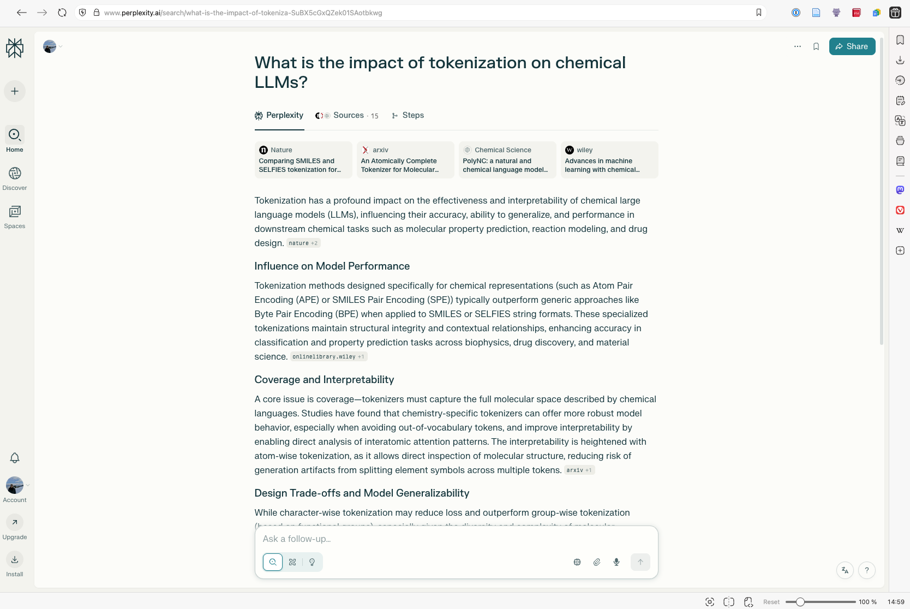
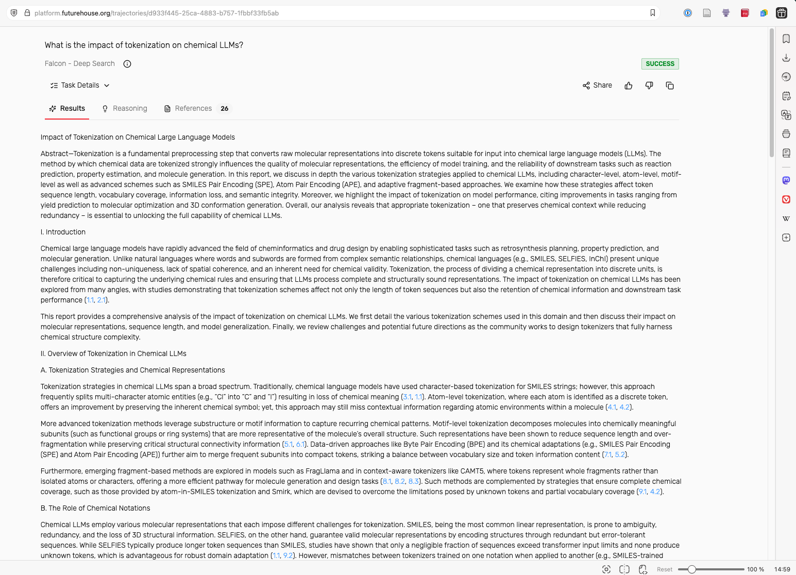
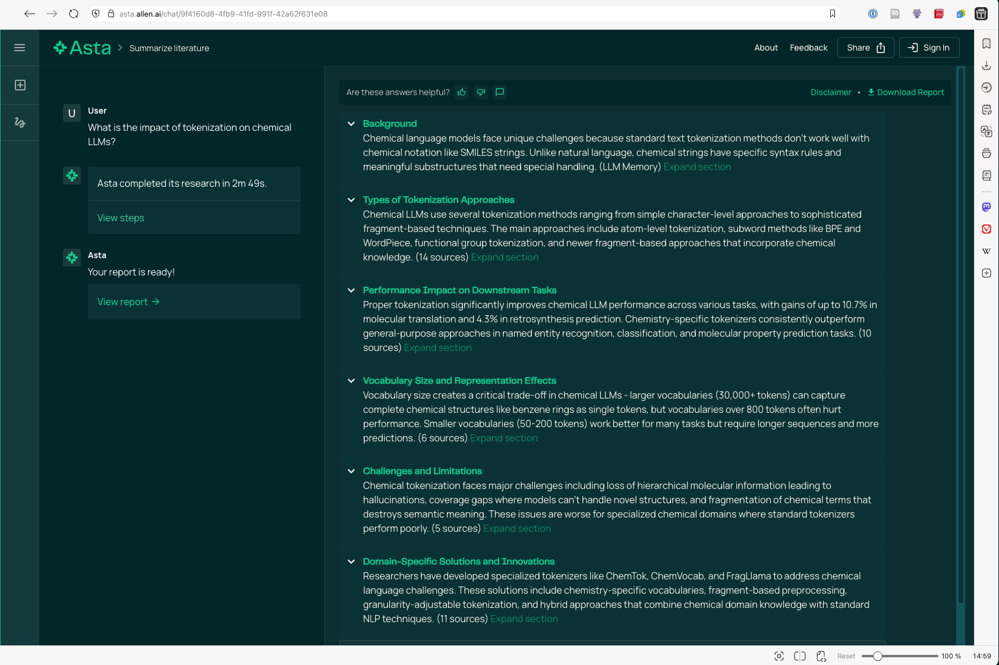
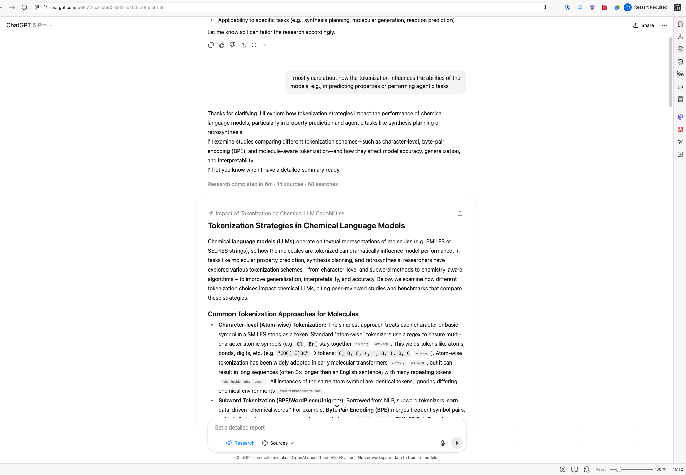

---
format:
  html:
    toc: true
    smooth-scroll: true
    anchor-sections: true
    other-links:
    - text: Visit our website
      href: https://lamalab.org/
      icon: globe
    - text: Follow us on X (Twitter)
      href: https://x.com/jablonkagroup
      icon: twitter-x
    - text: We are hiring!
      href: https://forms.fillout.com/t/eoGA7AhnAKus
      icon: person-badge
    - text: Contact us
      href: mailto:contact@lamalab.org
      icon: mailbox
acronyms:
  insert_loa: false 
  insert_links: false  
  fromfile: ./acronyms.yml
---

# Surveying the literature with LLMs {.unnumbered}

One of our primary usecases for using LLM-based workflows is to survey the literature. 
LLM-based agents are very useful for quickly obtaining an overview of what has been done in a field. 

One still has to keep a few caveats in mind: 

- Even when using LLM-based agents there is no guarantee that there are no hallucinations. While the hallucination rate is much lower than with pure LLMs, there can still be hallucinations.
- It is very difficult for those systems to be comprehensive. This has to do with the fact that some resources are very hard to access and that, in general, it is very difficult in machine learning systems to have a high precision and recall at the same time. 

## Answering general questions 

For answering general questions we often default to [Perplexity](https://www.perplexity.ai/).
This is based on web search and can compile answers to questions based on the search results.
It is fast, but will only give superficial answers to scientific questions.

## Answering scientific questions

### FutureHouse Platform

For surveying scientific papers, we often use the [FutureHouse Plaform](https://www.platform.futurehouse.org). On there, they have different agents. 

### Asta 

An alternative tool, [Asta](https://asta.allen.ai/chat), built by Ai2 can perform similar search and we often use it in combination with the FutureHouse Plaform.

### OpenAI Deep Research (💵)

Especially with [GPT-5 Pro, Deep Research](https://chatgpt.com/) can sometimes deliver impressive results. 

## "Consuming papers"

For more easily digesting papers, we use different tools 

- [NotebookLM](https://notebooklm.google.com/) is excellent for converting paper(s) into forms that are more easy to consume, such as podcasts, mindmaps, reports, videos. We mostly use it to generate podcasts to and study guides. The podcasts are particularly useful for getting key ideas (or even differences) between papers in a form that can be consumed on the go. Sometimes the results are also useful to inspire a narrative. 

- [Speechify](https://speechify.com) can be useful to listen to papers (instead of reading them).

## Guidelines 

- [ ] Use the results as starting point to help you be faster in identifying relevant literature
- [ ] Do not expect the results are all correct/free of hallucination 
- [ ] Do not expect the results are comprehensive 
- [ ] Complement with a conventional search, e.g., using Google Scholar